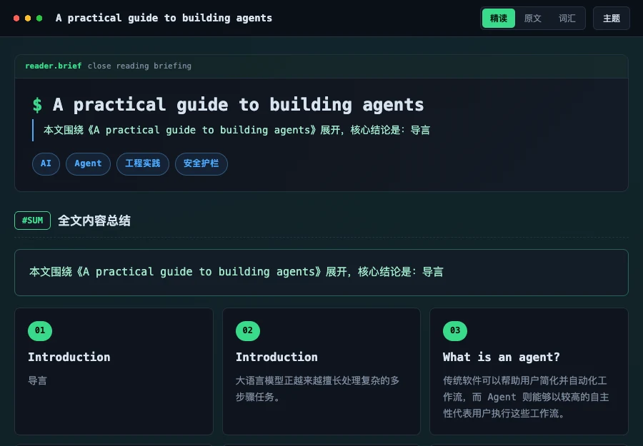

# Bilingual Reader

Bilingual Reader 是一个用于生成离线中英对照精读网页的 SKILL。它接收来自链接、图片、文档文件、本地文件路径、附件或粘贴文本的英文内容，先依赖 [Web Markdown](../web-markdown/README.zh-CN.md) 转换为标准 Markdown，再生成可直接从 `file://` 打开的自包含精读页面，适合英语学习、文章精读、词汇讲解和双语资料归档。

GitHub：<https://github.com/chaos-design/skills>

[English](./README.md)

## 功能介绍

- 标准工作流：原始输入 → `web-markdown` 转换为 Markdown → `bilingual-reader` 处理 Markdown、翻译并构建学习内容 → 输出自包含 HTML。
- 生成中英对照精读页面，包含 Hero、摘要、逐段原文对照、原文图片、词汇表和页脚来源。
- 支持链接、截图或扫描图片、PDF、DOCX、Markdown、HTML、纯文本、本地文件、附件和粘贴文本等输入来源（以 Agent 平台可访问能力为准）。
- 原文 tab 会直接保留可访问的原始图片：网页或文档按阅读顺序插入，截图或 OCR 输入会在原文开头展示源图参考；可取得图片字节时会内联到最终 HTML，保证 `file://` 可用。
- 支持 CEFR 词汇分级：`B1`、`B2`、`C1`、`C2`、`术语`。
- 支持 hover 词义提示、IPA、词性、例句、中文释义和浏览器原生朗读。
- 内置多套索引化视觉模板，模型会根据文章语气、内容密度、用户意图和语言需求自行选择。
- 最终 HTML 内联全部数据、CSS 和 JavaScript，无 CDN、无外部字体、无本地服务依赖。

## 模板图库

模板从 `assets/templates/templates.json` 中选择。用户未指定模板时，模型会根据文章内容、用户意图、语气、密度和语言需求，从索引模板中自行选择，不存在需要用户显式选择的 `default` 模板定义。

### `aurora-dashboard`


- 适用：AI 解释文、研究摘要、市场分析、指标较多的技术阅读。
- 不适用：安静文学随笔、古典内容，或不适合强仪表盘感的文章。

### `blueprint-grid`


- 适用：系统设计、工程笔记、API 概念、产品规格、流程型文章。
- 不适用：个人随笔或需要温暖感的轻松教学内容。

### `broadsheet`


- 适用：新闻分析、政策评论、历史写作、公共议题严肃文章。
- 不适用：高交互学习页面或现代 SaaS / 产品叙事。

### `card-atlas`


- 适用：长文、原文导读、概念地图、分章节阅读工作坊。
- 不适用：很短的文本或不需要持续导航的海报式页面。

### `command-center`


- 适用：战略简报、发布叙事、运营、安全、行动导向解释文。
- 不适用：平静反思型文章或考试复习材料。

### `compact-study`


- 适用：考试复习、精读训练、词汇密集材料、技术摘要。
- 不适用：需要展示感、氛围感和留白的内容。

### `editorial-split`


- 适用：随笔、访谈、文化评论、设计写作、强调排版气质的阅读。
- 不适用：高密度技术参考或卡片式背诵材料。

### `gradient-magazine`


- 适用：创意行业文章、趋势报告、产品故事、轻松教育内容。
- 不适用：监管披露、严肃学术阅读或需要克制视觉的内容。

### `ink-scroll`


- 适用：中国文化、历史、哲学、文学随笔、传统气质精读。
- 不适用：SaaS 仪表盘、运营简报、轻松年轻化内容。

### `kanban-flow`


- 适用：产品管理、创业文章、工作流解释、学习计划、执行清单。
- 不适用：古典文学阅读或情绪性叙事。

### `midnight-lab`



- 适用：开发者教育、调试故事、研究笔记、安全分析、实验记录式阅读。
- 不适用：温暖消费内容或传统纸媒式随笔。

### `mono-focus`


- 适用：代码相关内容、调查摘要、简报、低干扰技术学习。
- 不适用：设计感强的社论或高度视觉化叙事。

### `paper-notes`


- 适用：初学者友好阅读、课堂讲义、引导式学习、反思型文章。
- 不适用：硬核技术规格或需要强权威感的紧急简报。

### `synthwave-arcade`


- 适用：游戏、互联网文化、青年科技、创意编程、黑客松复盘。
- 不适用：医疗、金融、法律或信任敏感场景。

## 安装步骤

### 通过远程技能包安装

使用以下命令从远程仓库全局安装该技能：

```bash
npx skills add https://github.com/chaos-design/skills --skill web-markdown
npx skills add https://github.com/chaos-design/skills --skill bilingual-reader
```

`web-markdown` 是必需依赖，必须与 `bilingual-reader` 同时安装。若只安装 `bilingual-reader`，原始输入可能无法先标准化为 Markdown，后续正文提取、图片保留、代码块保留或翻译流程可能失败。

当 Agent 发现 `web-markdown` 缺失时，应先询问用户是否安装，展示上面的安装命令，并在依赖可用后再继续执行。

如果采用下面的手动复制方式安装，请把 `skills/web-markdown` 也复制到同一个 Agent 技能根目录下，形成与 `bilingual-reader` 同级的技能目录。

### 快捷添加到指定技能目录

当你已经知道目标 Agent 会扫描哪个技能目录时，可以直接复制到指定目录。请在本仓库根目录执行，并把 `DEST` 改成实际目标目录。

```bash
DEST=".agents/skills/bilingual-reader"
INSTALL_FILES=(SKILL.md prompt.md assets references)
mkdir -p "$DEST"
rm -rf "$DEST/tests"
cp -R "${INSTALL_FILES[@]}" "$DEST"/
```

目标目录根部必须能直接看到 `SKILL.md`。`assets/`、`references/` 等支撑目录需要和 `SKILL.md` 保持同级；可选视觉模板位于 `assets/templates/`。`tests/` 目录只是源码项目的校验用例，安装技能时不应复制；如果历史安装残留了 `tests/`，上述命令会从目标技能目录中清理掉。

### 安装到 Codex

Codex 会从当前仓库路径层级中的 `.agents/skills/`、`$HOME/.agents/skills/` 以及管理员/系统技能目录发现技能。安装为当前仓库技能：

```bash
DEST=".agents/skills/bilingual-reader"
INSTALL_FILES=(SKILL.md prompt.md assets references)
mkdir -p "$DEST"
rm -rf "$DEST/tests"
cp -R "${INSTALL_FILES[@]}" "$DEST"/
```

安装为跨仓库可用的用户级技能：

```bash
DEST="$HOME/.agents/skills/bilingual-reader"
INSTALL_FILES=(SKILL.md prompt.md assets references)
mkdir -p "$DEST"
rm -rf "$DEST/tests"
cp -R "${INSTALL_FILES[@]}" "$DEST"/
```

Codex 也可以在会话内通过 `$skill-installer` 安装目录型技能包或 GitHub 上的技能。添加后如果没有立即识别，请开启新的 Codex 会话。

### 安装到 Claude Code

Claude Code 的个人技能位于 `~/.claude/skills/<skill-name>/SKILL.md`，项目技能位于 `.claude/skills/<skill-name>/SKILL.md`。

```bash
DEST="$HOME/.claude/skills/bilingual-reader"
INSTALL_FILES=(SKILL.md prompt.md assets references)
mkdir -p "$DEST"
rm -rf "$DEST/tests"
cp -R "${INSTALL_FILES[@]}" "$DEST"/
```

如需只在当前项目生效，使用：

```bash
DEST=".claude/skills/bilingual-reader"
INSTALL_FILES=(SKILL.md prompt.md assets references)
mkdir -p "$DEST"
rm -rf "$DEST/tests"
cp -R "${INSTALL_FILES[@]}" "$DEST"/
```

如果复制后没有出现新技能，请重启 Claude Code。

### 安装到 Trae

Trae 的项目技能位于 `.trae/skills/`，macOS/Linux 的全局技能位于 `~/.trae/skills/`。部分 Trae CN 安装使用 `~/.trae-cn/skills/`；如果「设置 > 技能与命令」中显示了不同的全局目录，请以设置页为准。

```bash
DEST="$HOME/.trae/skills/bilingual-reader"
INSTALL_FILES=(SKILL.md prompt.md assets references)
mkdir -p "$DEST"
rm -rf "$DEST/tests"
cp -R "${INSTALL_FILES[@]}" "$DEST"/
```

对于使用 `.trae-cn` 主目录的 Trae CN 本地安装：

```bash
DEST="$HOME/.trae-cn/skills/bilingual-reader"
INSTALL_FILES=(SKILL.md prompt.md assets references)
mkdir -p "$DEST"
rm -rf "$DEST/tests"
cp -R "${INSTALL_FILES[@]}" "$DEST"/
```

如需只在当前项目生效，使用：

```bash
DEST=".trae/skills/bilingual-reader"
INSTALL_FILES=(SKILL.md prompt.md assets references)
mkdir -p "$DEST"
rm -rf "$DEST/tests"
cp -R "${INSTALL_FILES[@]}" "$DEST"/
```

### 作为源码项目使用

```bash
git clone https://github.com/chaos-design/skills.git
cd skills
```

## 使用方法

向支持 SKILL 的 Agent 提出类似请求：

```text
把这篇英文文章做成中英对照精读网页，包含摘要、逐段原文对照、CEFR 词汇表、hover 词义提示和浏览器原生发音。
```

Agent 会执行以下流程：

1. 获取链接、读取文档或文件、从图片中识别文本，或使用粘贴文本中的英文内容。
2. 调用 `web-markdown` 将原始输入转换为标准 Markdown，保留标题、来源信息、正文、图片、链接、表格和代码块。
3. 按阅读顺序从 Markdown 中提取标题、来源信息和正文段落。
4. 翻译、组织学习内容，并从 `assets/templates/<name>/template.html` 中选择一个索引模板。
5. 将内容、主题、运行时 CSS 和 JS 内联到最终 HTML。
6. 校验生成结果中不存在外部脚本、外部样式、`fetch()`、模块导入或未替换占位符。

支持的输入来源：

- 链接：抓取网页并提取英文正文。
- 图片：通过视觉识别/OCR 提取截图或扫描件中的可见英文文本。
- 文档和文件：读取可访问的 PDF、DOCX、Markdown、HTML、纯文本、本地文件路径或附件。
- 粘贴文本：直接使用用户提供的文本。

### 故障排查

- 如果正文为空、段落顺序错误、原始图片/代码块缺失或精读页面生成失败，请先检查 `web-markdown` 是否已正确安装。
- 单独运行 `web-markdown` 检查同一输入是否能生成有效 Markdown；若该步骤失败，应先修复抓取或 Markdown 转换问题。

## 配置说明

核心配置来自以下文件：

```text
.
├── SKILL.md                    # Trae 技能入口，包含触发条件、工作流和质量规则
├── prompt.md                   # 可移植执行说明，适合不同 Agent 平台读取
├── references/
│   └── data-schema.md          # data.json 的字段契约和内容规则
├── assets/
│   ├── template.html           # 渲染器使用的基础页面外壳
│   ├── runtime.css             # 共享样式能力
│   ├── runtime.js              # 主题切换、词汇提示、自动包裹、朗读、词汇分组和阅读进度
│   └── templates/
│       ├── templates.json      # 可选模板的紧凑索引，供 Agent 先筛选再加载
│       └── <name>/
│           └── template.html   # 可选视觉模板
```

主题变量通过模板中的 `THEME` 对象注入，文章内容只允许进入 `data.json`，不要为了单篇文章修改模板源码。

## 示例

最小词汇条目：

```json
{
  "autonomous": {
    "w": "autonomous",
    "ipa": "/ɔːˈtɒnəməs/",
    "pos": "adj.",
    "level": "C1",
    "def": "自主的，自治的；无需外部控制即可运作的。",
    "eg": "Fully autonomous systems operate independently.",
    "egzh": "完全自主的系统能独立运行。"
  }
}
```

摘要视图中的 hover 标记：

```html
<span class="w" data-k="autonomous">autonomous<span class="tip"></span></span>
```

原文视图不手写 hover 标记，而是在 `glossary.autowrap` 中配置：

```json
["\\bautonomous\\b", "i", "autonomous"]
```

## 质量检查

```bash
python3 -m json.tool skills/bilingual-reader/assets/templates/templates.json > /dev/null
```

该检查用于确认模板索引是合法 JSON。技能本身是文件资产包，不依赖外部构建步骤。

## 项目结构

```text
.
├── SKILL.md                         # 根目录技能入口
├── prompt.md                        # 可移植 Agent 执行说明
├── assets/                          # 基础页面外壳与共享运行时
│   └── templates/                   # 渐进加载的可选视觉模板包
└── references/                      # data.json 数据契约
```

本仓库将技能运行文件放在 `skills/bilingual-reader`，更长的用户介绍文档放在 `skills/bilingual-reader`。

## 许可证

本项目使用 Apache License 2.0，详见 [LICENSE](LICENSE)。
