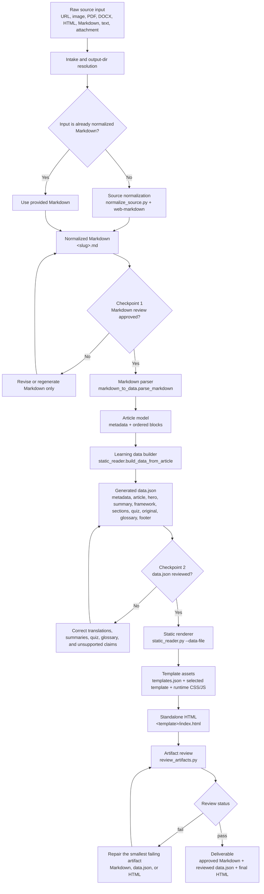
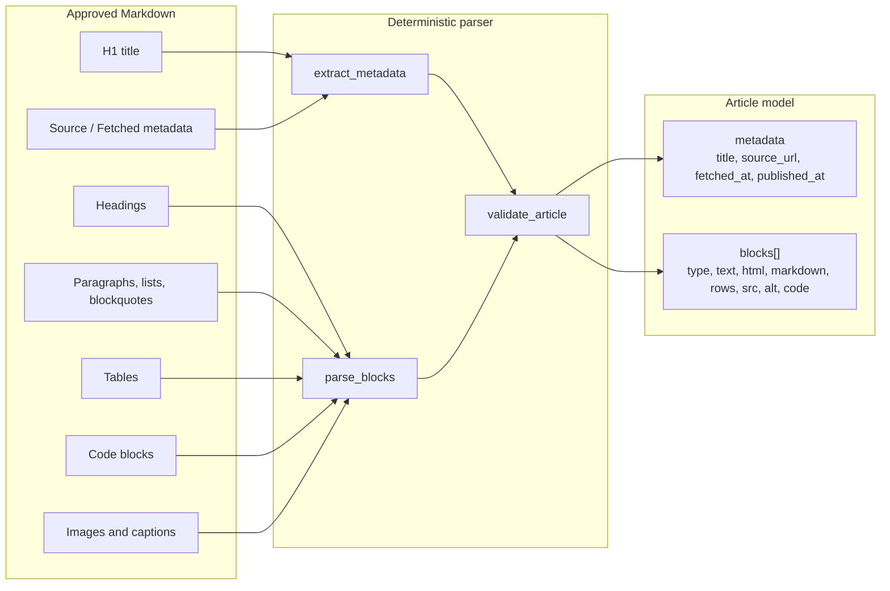
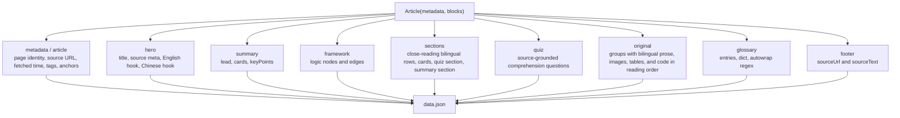
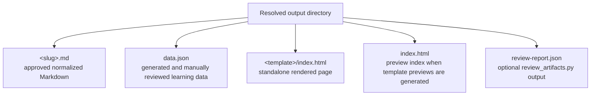
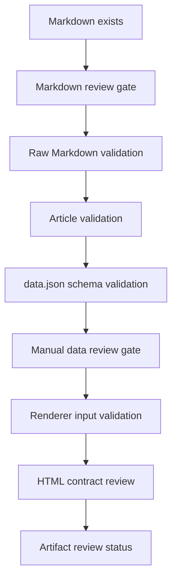

# Bilingual Reader Data Processing Flow

This document describes the complete `bilingual-reader` data path from raw source intake to
normalized Markdown, reviewed learning data, static HTML, and final artifact review.

The pipeline is checkpointed by design. Markdown must be reviewed before parsing and enrichment.
`data.json` must be reviewed before rendering HTML. These gates prevent unsupported translation,
summary, glossary, or layout content from reaching the final page.

## End-to-End Flow



## Processing Nodes

| Node | Processor | Input | Transformation | Output |
| --- | --- | --- | --- | --- |
| Source intake | Agent workflow | User-provided URL, image, PDF, DOCX, HTML, Markdown, text, attachment, or local path | Decide whether normalization is required and resolve the exact output directory before generating files. | Target output directory and source type. |
| Source normalization | `scripts/normalize_source.py` with `web-markdown` | Raw URL or extracted source HTML | Fetch or load source content, convert readable content into Markdown, preserve source order, metadata, images, links, tables, and code blocks when accessible. | `<slug>.md` with one H1, `Source`, `Fetched`, and normalized body blocks. |
| Markdown checkpoint | Human review | Generated Markdown | Verify body completeness, image/table/code preservation, source order, and metadata accuracy. No parser, template, `data.json`, or HTML generation may run before approval. | Approved Markdown or Markdown revision request. |
| Markdown validation | `markdown_to_data.validate_raw_markdown` and metadata checks | Approved Markdown text | Reject empty input, oversized input, unsupported control characters, missing or duplicate H1, invalid `Source`, invalid `Fetched`, unsafe image URLs, malformed tables, or unclosed code fences. | Parseable Markdown. |
| Format parsing | `markdown_to_data.parse_markdown` | Valid Markdown | Convert Markdown into deterministic block objects: heading, paragraph, list, blockquote, table, code, and image. Inline Markdown is rendered into safe HTML fragments where needed. | `Article(metadata, blocks)`. |
| Content segmentation | `markdown_to_data.parse_blocks` and original-row builders | Ordered article blocks | Preserve reading order and merge consecutive prose into larger translation units for the original view while keeping images, tables, and code as typed rows. | Structured article sections and original-view groups. |
| Learning enrichment | `static_reader.build_data_from_article` and `markdown_to_data.build_learning_data` | `Article(metadata, blocks)` | Build title metadata, hero hook, summary cards, logic framework, bilingual close-reading sections, quiz, original tab data, footer source link, and glossary runtime data. | Draft `data.json`. |
| Data checkpoint | Human review | Draft `data.json` | Review every `zh` and `zh*` field against the corresponding English source, remove unsupported interpretation, correct terminology, and ensure quiz, framework, captions, and glossary remain source-grounded. | Reviewed `data.json`. |
| Template rendering | `scripts/static_reader.py --data-file` | Reviewed `data.json` and selected template metadata | Validate data contract, load selected template CSS, inline article content into the DOM, inline runtime CSS/JS, optionally inline accessible source images. | Self-contained HTML page under `<template>/index.html`; preview `index.html` when rendering template previews. |
| Final artifact review | `scripts/review_artifacts.py` | Approved Markdown, reviewed `data.json`, generated HTML | Check Markdown metadata and syntax, data schema and source fidelity, glossary source backing, HTML contract, required sections, image bounds, duplicate IDs, and offline-safety rules. | JSON review report with `status: pass` or `status: fail`. |

## Data Transformation Detail



The parser does not invent learning content. Its role is to turn the approved Markdown into a
validated article model while preserving source order and source-backed rich content.

## Data Branches Generated from the Article Model



### Close-Reading Data

`sections` is the main close-reading view. It is built from the article blocks and should explain
the source in coherent learning units:

- `sections[].rows[].en` keeps source-backed English content or concise source-grounded explanation.
- `sections[].rows[].zh` is the corresponding Chinese translation or explanation.
- Card sections are used only when the source supports comparison, workflow, pattern, or checklist
  structures.
- Summary sections must state conclusions that can be traced to the approved Markdown.
- Inline hover words in close-reading English rows must point to keys in `glossary.dict`.

### Original Data

`original.groups` preserves the source-facing reading experience:

- Consecutive prose blocks are merged into larger English/Chinese rows for comfortable side-by-side
  reading.
- Images appear only when they came from the source Markdown or accessible document extraction.
- Tables keep the original table shape and add Chinese row translations through `zhRows`.
- Code blocks preserve source indentation and language metadata.
- Original-view vocabulary highlighting is driven by `glossary.autowrap`, not by manually wrapping
  every occurrence.

### Glossary Data

`glossary` is source constrained:

- Every vocabulary item must appear in the approved source text, including tables, code, image
  captions, and other parsed source blocks.
- Lemmas are allowed when the source contains an inflected form, such as plural nouns or verb tense
  variants.
- Multi-word terms and hyphenated terms must match the source phrase.
- `dict` provides runtime lookup data, and `autowrap` maps regular expressions to existing `dict`
  keys for original-view highlighting.
- Levels are limited to `B1`, `B2`, `C1`, `C2`, and `术语`.

## Storage and Output Layout



Typical commands:

```bash
python3 skills/bilingual-reader/scripts/normalize_source.py "<URL>" --output-dir tests/bilingual-reader
python3 skills/bilingual-reader/scripts/static_reader.py tests/bilingual-reader/<slug>.md --output-dir tests/bilingual-reader --data-only
python3 skills/bilingual-reader/scripts/static_reader.py --data-file tests/bilingual-reader/data.json --output-dir tests/bilingual-reader --template compact-study
python3 skills/bilingual-reader/scripts/review_artifacts.py --markdown tests/bilingual-reader/<slug>.md --data tests/bilingual-reader/data.json --html tests/bilingual-reader/compact-study/index.html
```

For multiple Markdown inputs, each source should use a separate stable subdirectory so its approved
Markdown, reviewed `data.json`, rendered HTML, and review report remain isolated from other sources.

## Validation Gates



The main validation responsibilities are:

- Markdown must be non-empty, within size limits, contain exactly one H1, include valid `Source` and
  `Fetched` metadata, and avoid malformed tables, unsupported image sources, and unclosed code
  fences.
- `data.json` must include `metadata`, `article`, `hero`, `summary`, `framework`, `sections`,
  `quiz`, `original`, `glossary`, and `footer`.
- Chinese fields must contain Chinese text and match the corresponding source-backed English.
- Quiz answers must be in range, options must be unique, and explanations must be source-grounded.
- Glossary entries must use allowed levels and be backed by source words, inflections, phrases, or
  terms.
- HTML must be standalone, open from `file://`, inline visible article content in normal DOM nodes,
  include required views, preserve original images/tables/code, and avoid runtime `fetch()` or
  module dependencies.

## Responsibility Boundaries

| Artifact | Primary owner | May contain generated interpretation? | Review requirement |
| --- | --- | --- | --- |
| `<slug>.md` | `web-markdown` normalization plus agent correction | No. It should represent source content and metadata. | Must be explicitly approved before parsing. |
| `Article(metadata, blocks)` | Deterministic parser | No. It is a structured representation of Markdown. | Validated by parser rules. |
| `data.json` | Agent enrichment plus data builders | Yes, but only when grounded in the approved Markdown. | Must be manually reviewed before HTML rendering. |
| `<template>/index.html` | Static renderer and selected template | No new facts. It renders reviewed `data.json`. | Must pass page contract and artifact review. |
| `review-report.json` | `review_artifacts.py` | No. It reports findings only. | A failing report blocks delivery. |
