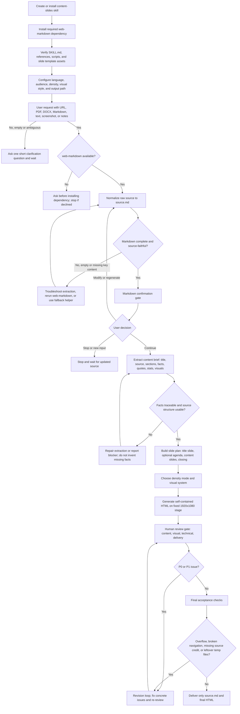

# Content Slides

[中文](./README.zh-CN.md)

Content Slides converts existing source material into a self-contained 16:9 HTML slide deck. Use it when the user provides URLs, PDFs, DOCX files, Markdown files, plain text, screenshots, or pasted notes and asks for slides, a presentation, a frontend slide deck, or an HTML deck. It depends on [Web Markdown](../web-markdown/README.md) for source normalization into Markdown before deck generation.

Content Slides is a conversion-first skill: the source already exists, and the skill extracts, restructures, designs, validates, and delivers one browser-runnable HTML deck. For reusable deck-stage templates and the larger visual template gallery, see [Frontend Slides](../frontend-slides/README.md).

## Install

Install this skill directly from the Chaos Design Skills repository:

```bash
npx skills add https://github.com/chaos-design/skills --skill web-markdown
npx skills add https://github.com/chaos-design/skills --skill content-slides
```

`web-markdown` is a required dependency and must be installed alongside `content-slides`. If only `content-slides` is installed, URL or complex source content may not be normalized to Markdown and downstream deck generation may fail.

When an agent discovers that `web-markdown` is missing, it should ask the user before installing it, show the command above, and continue only after the dependency is available.

## Capabilities

- Standard workflow: raw input -> `web-markdown` performs source normalization -> `content-slides` extracts a content brief and generates the HTML deck.
- Accepts URLs, PDFs, DOCX files, Markdown files, plain text, screenshots, and pasted notes when the Agent platform can access them.
- Final output contains only `source.md` and one browser-runnable HTML deck authored on a fixed 1920×1080 stage.
- Defaults to Simplified Chinese slide content unless the user requests another language.
- Uses keyboard, wheel, touch, and compact bottom previous/next controls. Slides include no anchor or jump-dot information by default; side anchors are opt-in only.
- Image source credits are optional; when included, they should use very small, low-emphasis type. Article/source credits keep the original English source title inside `原文：...` links when available.
- Generated slides should not include extra `Description` blocks or visible "generated by content-slides" notes; keep only source-derived slide content, necessary labels/captions, and source attribution.
- Multiple peer modules on one slide must split available width evenly and align to a balanced grid. Even counts must not create 3+1, left-heavy, or half-empty rows; use 2x2 for four modules and 3x2 for six modules.
- Includes a fallback helper script for source extraction when the primary normalization path is unavailable.

## Screenshot


The screenshot is generated from `tests/content-slides/a-practical-guide-to-building-ai-agents/a-practical-guide-to-building-ai-agents.html`.

## Usage

Invoke the skill when the user asks to turn existing material into slides, for example:

```text
Use content-slides to turn this article URL into a Chinese HTML presentation: https://example.com/report
```

```text
用 content-slides 把这份 PDF 做成高密度阅读型汇报页，保留关键数据和来源。
```

```text
Make a slide deck from the attached screenshot. Treat the screenshot as the source content.
```

The source can be a URL, PDF, DOCX file, Markdown file, plain text, screenshot, pasted notes, or a combination of notes plus screenshots when the Agent platform can access those inputs.

### Workflow

The skill follows the same review-gated workflow defined in `SKILL.md`. The first HTML deck is always a draft; it is not final until Markdown confirmation, review, revision, and final acceptance all pass.



1. Detect the input type and output constraints: URL, PDF, DOCX file, Markdown file, plain text, screenshot, pasted notes, target language, audience, density, and output location.
2. Normalize the raw input with `web-markdown`, preserving title, source, body text, images, links, tables, and code blocks. Use `scripts/extract_content.py` only as a fallback when the dependency or source type blocks the default path.
3. Pause at the Markdown confirmation gate. Ask whether to continue, modify/regenerate Markdown, or stop with new input. Do not build the content brief, slide plan, or HTML before confirmation.
4. Extract a compact content brief: source title, deck name, source URL/path, sections, key facts, quotes, stats, tables, code, and usable visual assets.
5. Build the slide plan with a source-related title slide, optional agenda, content slides, visual mapping, and closing/source attribution.
6. Choose the density mode:
   - **Low density / speaker-led** for talks, keynotes, and pitches.
   - **High density / reading-first** for reports, articles, and async handouts.
7. Pick one visual style from `references/style-presets.md`, choose motion only when useful, and keep the theme readable and consistent.
8. Generate one self-contained HTML file on a fixed 1920×1080 stage using `references/html-template.md` and `references/viewport-base.css`.
9. Run the human review gate across `source.md`, the slide plan, and the rendered draft: content fidelity, visual quality, technical behavior, and delivery readiness.
10. Fix every P0/P1 issue through the revision loop, then rerun the affected checks. Cap normal repair loops at three rounds; if blockers remain, report them instead of delivering.
11. Final acceptance verifies one-slide-at-a-time visibility, 16:9 scaling, navigation, source links, no overflow/overlap/clipping, and cleanup.
12. Delete temporary review, revision, metadata, scratch, screenshot, or planning artifacts before finishing.

### Boundary cases

- **Empty or ambiguous input** — ask one concise clarification question and stop until the user provides a usable source.
- **Missing `web-markdown`** — ask before installing it; if unavailable or declined, explain that reliable source normalization is blocked.
- **Failed Markdown extraction** — do not continue with partial content. Repair extraction, rerun `web-markdown`, or use the fallback helper for supported local files.
- **User rejects generated Markdown** — modify or regenerate Markdown, then ask for confirmation again before continuing.
- **Only screenshot provided** — treat visible screenshot content as the source; transcribe observable text/data and avoid inventing hidden context.
- **Notes plus screenshots** — use notes as the main narrative and screenshots only as evidence or visual assets.
- **Thin sections or missing visuals** — make tighter slides; do not add stock images, fake charts, invented citations, or decorative filler.
- **Slide overflow or unreadable content** — split into more slides rather than shrinking text below a comfortable size.
- **P0/P1 review findings** — block delivery until fixed and re-reviewed.
- **Temporary artifacts** — do not keep review reports, metadata, screenshots, scratch files, or slide plans in the final output folder.

### Output

Final output should contain only the normalized Markdown source and the generated HTML deck. Generated HTML files should be named from the source title, not generic names such as `index.html` or `slides.html`:

```text
source.md
<source-title-slug>.html
```

### Practical Notes

- Default deck language is Simplified Chinese unless the user requests another language.
- Preserve facts, numbers, quotes, and source attribution; do not invent filler content.
- Split overflowing slides instead of shrinking text below comfortable reading size.
- Keep slide chrome outside the scaled stage and verify keyboard, wheel, touch, and bottom control navigation before delivery.

### Troubleshooting

- If content processing fails, the body is empty, or images/code blocks are missing, first confirm that `web-markdown` is installed correctly.
- Run `web-markdown` on the same input and verify that it produces valid Markdown. Fix fetching or Markdown conversion before continuing with deck generation.

## Skill Files

```text
skills/content-slides/
├── SKILL.md
├── references/
│   ├── animation-patterns.md
│   ├── html-template.md
│   ├── style-presets.md
│   └── viewport-base.css
└── scripts/
    └── extract_content.py
```

Read [SKILL.md](SKILL.md) for the full workflow and generation rules.

## Updating Screenshots

When the example deck changes, regenerate the screenshot from the test fixture at 1280×720 and save it as:

```text
screenshots/content-slides/a-practical-guide-to-building-ai-agents.webp
```
