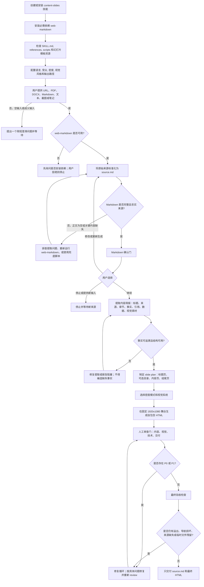

# Content Slides

[English](./README.md)

Content Slides 用于把已有来源材料转换为自包含的 16:9 HTML 幻灯片。当用户提供 URL、PDF、DOCX 文件、Markdown 文件、纯文本、截图或粘贴笔记，并希望生成 slides、presentation、frontend slide deck 或 HTML deck 时使用。它依赖 [Web Markdown](../web-markdown/README.zh-CN.md) 完成 Markdown 来源标准化，再基于 Markdown 生成最终 deck。

Content Slides 是转换优先型技能：来源内容已经存在，技能负责提取、重组、设计、校验并交付一个可在浏览器运行的 HTML deck。如果需要可复用的 deck-stage 模板和更完整的视觉模板图库，请参考 [Frontend Slides](../frontend-slides/README.zh-CN.md)。

## 安装

可以直接从 Chaos Design Skills 仓库安装该 Skill：

```bash
npx skills add https://github.com/chaos-design/skills --skill web-markdown
npx skills add https://github.com/chaos-design/skills --skill content-slides
```

`web-markdown` 是必需依赖，必须与 `content-slides` 同时安装。若只安装 `content-slides`，URL 或复杂来源内容可能无法先转换为标准 Markdown，后续幻灯片生成也可能失败。

当 Agent 发现 `web-markdown` 缺失时，应先询问用户是否安装，展示上面的安装命令，并在依赖可用后再继续执行。

## 能力

- 标准工作流：原始输入 → `web-markdown` 执行来源标准化 → `content-slides` 提取内容简报并生成 HTML deck。
- 在 Agent 平台可访问的前提下，支持 URL、PDF、DOCX 文件、Markdown 文件、纯文本、截图和粘贴笔记。
- 最终只保留 `source.md` 和一个可在浏览器运行的 HTML deck，HTML 按固定 1920×1080 舞台创作。
- 除非用户要求其他语言，默认生成简体中文幻灯片内容。
- 首页主标题必须贴合来源文章主题或中心论点，可补充副标题/个人解读式副标题；首页内容默认放在画布中间。
- 支持键盘、滚轮、触摸和紧凑的底部上一页/下一页控制；默认不生成锚点或跳转点信息，侧边锚点仅在用户明确要求时生成。
- 包含来源提取兜底辅助脚本，用于主标准化路径不可用的场景。

## 截图


截图从 `tests/content-slides/a-practical-guide-to-building-ai-agents/a-practical-guide-to-building-ai-agents.html` 生成。

## 使用方式

当用户希望把已有材料变成幻灯片时调用该技能，例如：

```text
Use content-slides to turn this article URL into a Chinese HTML presentation: https://example.com/report
```

```text
用 content-slides 把这份 PDF 做成高密度阅读型汇报页，保留关键数据和来源。
```

```text
Make a slide deck from the attached screenshot. Treat the screenshot as the source content.
```

来源可以是 URL、PDF、DOCX 文件、Markdown 文件、纯文本、截图、粘贴笔记，或笔记加截图的组合，只要 Agent 平台能够访问这些输入。

### 工作流

该技能遵循 `SKILL.md` 中定义的线性、带人工审查门的执行流程。第一次生成的 HTML deck 只是草稿；只有 Markdown 确认、人工审查、修复循环和最终验收全部通过后，才能交付为最终版本。



#### 阶段输入、输出与关卡

| 阶段 | 节点 | 必需输入 | 必需输出 | 关卡 / 停止条件 |
| --- | --- | --- | --- | --- |
| 0 | 识别输入 | 用户来源与约束 | `source-request`：输入类型、语言、受众、截止时间、输出位置 | 来源为空或歧义时停止并询问 |
| 1 | 来源转 Markdown | `source-request` | 由 `web-markdown` 生成的 `source.md` 与来源元信息 | Markdown 为空、缺章节、缺表格/图片/代码或不忠实来源时停止修复 |
| 1.5 | Markdown 确认门 | `source.md` 与来源元信息 | 用户选择：继续 / 修改或重新生成 / 停止 | 用户确认前不得进入内容简报、slide plan 或 HTML 生成 |
| 2 | 内容简报 | `source.md` | 标题、来源、章节、关键事实、引用、数据、视觉素材清单 | 关键事实无法追溯时停止修复 |
| 3 | Slide Plan | 内容简报 | slide 列表、密度模式、叙事结构、素材映射 | 长篇或高风险 deck 需要确认大纲 |
| 4 | 视觉系统 | slide plan、用户偏好、来源语气 | 视觉 preset、色板、字体组合、动效方向 | 可读性或品牌约束冲突时停止处理 |
| 5 | HTML 草稿 | slide plan、视觉系统、模板引用 | 初版 `<deck-name>.html` | 只算草稿，不得直接交付 |
| 6 | Human Review Gate | HTML 草稿、`source.md`、slide plan | 内部审查结论 | P0/P1 阻塞交付 |
| 7 | Revision Loop | 审查问题与草稿 | 修复后的 HTML | P0/P1 必须修复并重新审查，常规最多三轮 |
| 8 | 最终验收与交付 | 通过 review 的 HTML | 仅 `source.md` 与最终 HTML | 验收项未通过或有临时产物残留时不得交付 |

1. 判断输入类型和输出约束：URL、PDF、DOCX 文件、Markdown 文件、纯文本、截图、粘贴笔记、目标语言、受众、密度和输出位置。
2. 调用 `web-markdown` 标准化原始输入，保留标题、来源、正文、图片、链接、表格和代码块。只有在依赖不可用或来源类型阻塞默认路径时，才用 `scripts/extract_content.py` 作为兜底。
3. 停在 Markdown 确认门：询问用户继续、修改/重新生成 Markdown，或停止并提供新输入。用户确认前不得提取内容简报、制定 slide plan 或生成 HTML。
4. 从标准 Markdown 中提取内容简报：来源标题、deck 名称、来源 URL/路径、章节、关键事实、引用、数据、表格、代码和可用视觉素材。
5. 制定 slide plan：包含与来源主题相关的标题页、可选目录页、内容页、视觉素材映射和结尾/来源归因页。标题页主标题不能使用“文章总结”“阅读笔记”“Presentation Title”或文件名/URL slug 这类泛名。
6. 选择密度模式：
   - **低密度 / 演讲型**：适合演讲、keynote 和 pitch。
   - **高密度 / 阅读型**：适合报告、文章和异步阅读材料。
7. 从 `references/style-presets.md` 中选择一个视觉风格，仅在有必要时加入额外动效，并保证主题可读且全 deck 一致。
8. 使用 `references/html-template.md` 和 `references/viewport-base.css`，在固定 1920×1080 舞台上生成一个自包含 HTML 文件。
9. 对 `source.md`、slide plan 和渲染后的草稿执行人工审查门：内容忠实度、视觉质量、技术行为和交付准备度。
10. 通过修订循环修复所有 P0/P1 问题，并重新运行相关检查。常规修复最多三轮；若仍有阻塞，应报告问题而不是交付。
11. 最终验收检查单页可见、16:9 缩放、导航、来源链接、无溢出/重叠/裁切，以及临时产物清理。
12. 流程结束前删除临时 review、revision、metadata、scratch、截图或规划产物。

### 边界情况

- **输入为空或存在歧义**：只提一个简短澄清问题，并在用户提供可用来源前停止。
- **缺少 `web-markdown`**：先询问是否安装；若依赖不可用或用户拒绝，说明可靠来源标准化被阻塞。
- **Markdown 提取失败**：不得基于残缺内容继续生成；应修复提取、重新运行 `web-markdown`，或对支持的本地文件使用兜底脚本。
- **用户不接受生成的 Markdown**：按要求修改或重新生成 Markdown，并再次进入确认门。
- **只提供截图**：把截图可见内容视为来源；只转写可观察文本/数据，不补充不可见背景。
- **笔记加截图**：以笔记作为主叙事，截图只作为证据或视觉素材。
- **章节内容过薄或缺少图片**：生成更紧凑的页面；不要添加图库图片、假图表、虚构引用或装饰性填充。
- **页面溢出或阅读困难**：拆分成更多幻灯片，不要把字号缩小到难以阅读。
- **首页标题泛化或位置偏上**：重写为与文章主题/中心论点相关的主标题，并把主标题、副标题、来源作为一个标题组放在 1920×1080 画布中间。
- **存在 P0/P1 审查问题**：阻塞交付，必须修复并重新审查。
- **临时产物**：最终输出目录不得保留审查报告、metadata、截图、scratch 文件或 slide plan。

### 输出

最终输出只保留标准化 Markdown 来源和生成的 HTML deck。生成的 HTML 文件应基于来源标题命名，不要使用 `index.html` 或 `slides.html` 这类泛名：

```text
source.md
<source-title-slug>.html
```

### 实践注意事项

- 默认 deck 语言是简体中文，除非用户要求其他语言。
- 保留事实、数字、引用和来源归因；不要编造填充内容。
- 首页标题优先表达来源文章的核心主题或论点；可以加入简短副标题或个人理解式 framing，但必须能从来源内容推出。
- 首页内容默认使用居中标题组，避免贴近顶部或只使用左上角标题。
- 内容溢出时拆分为更多幻灯片，不要把字号缩到难以阅读。
- 幻灯片 chrome 应放在缩放舞台之外，交付前验证键盘、滚轮、触摸和底部控制导航。

### 故障排查

- 如果内容处理失败、正文为空、图片/代码块缺失，先确认 `web-markdown` 已正确安装。
- 单独运行 `web-markdown` 检查同一输入是否能生成有效 Markdown；若该步骤失败，应先修复抓取或 Markdown 转换问题。

## 技能文件

```text
skills/content-slides/
├── SKILL.md
├── references/
│   ├── animation-patterns.md
│   ├── html-template.md
│   ├── style-presets.md
│   └── viewport-base.css
└── scripts/
    └── extract_content.py
```

完整工作流与生成规则见 [SKILL.md](SKILL.md)。

## 更新截图

示例 deck 变化时，从 1280×720 的测试夹具重新生成截图，并保存为：

```text
screenshots/content-slides/a-practical-guide-to-building-ai-agents.webp
```
