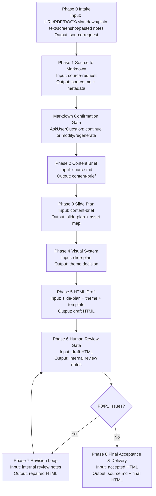

# Content Slides

Turn existing content — URLs, PDFs, DOCX files, Markdown files, plain text, screenshots, or pasted notes — into a professional, self-contained HTML slide deck. The final persisted output is exactly two files: `source.md` plus one HTML file built on a fixed 1920×1080 16:9 stage that scales to any viewport, with zero runtime dependencies except optional web fonts.

This skill is **conversion-first and review-gated**. The source content already exists; the job is to normalize it through `web-markdown`, restructure it into a well-paced slide narrative, generate a polished HTML draft, run a formal human review loop, repair the draft, and deliver only after acceptance criteria pass. Do not skip the review gate: an initial HTML deck is a draft, not a final deliverable.

Required dependency: `web-markdown` must be installed and available alongside this skill. The expected collaboration flow is: URLs/PDFs/DOCX/Markdown/plain text/screenshots/pasted notes -> `web-markdown` converts the source to standard Markdown -> `content-slides` extracts the content brief from that Markdown -> the skill plans, designs, generates, reviews, repairs, verifies, and delivers one HTML file.


## Dependency Installation

If `web-markdown` is not installed or cannot be discovered by the agent, pause before continuing and ask the user whether to install the dependency. Show the exact command:

```bash
npx skills add https://github.com/chaos-design/skills --skill web-markdown
```

After the user agrees, run or ask them to run the install command according to the current agent environment. Then retry discovery and continue only after `web-markdown` is available. If the user declines, explain that source content cannot be normalized into reliable Markdown and stop the deck workflow instead of generating slides from incomplete extraction.

## Default Language

Unless the user explicitly specifies otherwise, the **default deck language is zh-CN (Simplified Chinese)**. This governs everything the viewer reads: slide titles, body text, bullets, captions, the closing/source credit, and the on-screen chrome (the bottom control bar labels and any visible control text).

- If the source content is in another language (e.g., an English article), translate it into natural, fluent Simplified Chinese while keeping it faithful to the meaning — don't do a stiff literal translation. Preserve proper nouns, brand names, product names, code, URLs, and numbers as-is.
- Source tables, captions, diagram labels, image explanations, and visible UI text that are surfaced in the deck should be translated into the target language when practical. Preserve code, URLs, API names, product names, model names, and exact numeric values.
- If the user writes to you in another language, or explicitly asks for the deck in a specific language, follow that instead.
- Quoted material may stay in its original language when the quote itself matters, but add a Chinese gloss if it aids understanding.

## Core Principles

1. **Two-file final output** — Persist only `source.md` and one HTML file with CSS/JS and visual assets embedded inline. No npm, no build step, no runtime framework, and no sibling asset folder.
2. **Fixed 16:9 stage (non-negotiable)** — Every slide is authored at 1920×1080 and the whole stage is scaled uniformly to the window. Never reflow slide content per device; letterbox/pillarbox instead. This is what makes the deck look identical on a laptop and a phone.
3. **Fidelity to the source** — You are converting, not inventing. Preserve the source's meaning, key facts, numbers, quotes, structure, and original visual content. Don't hallucinate content or generate replacement images to fill slides; if a section is thin, make a tighter slide rather than padding it.
4. **Distinctive design, no "AI slop"** — Pick fonts, color, and layout that feel authored for the content. Avoid Inter/Roboto/Arial, purple-gradient-on-white, and cookie-cutter card grids. See [references/style-presets.md](references/style-presets.md).
5. **Human review before delivery** — The first generated HTML file must pass content, visual, technical, and delivery review before it can be called final. P0/P1 review issues block delivery.
6. **Progressive disclosure** — This SKILL.md is the map. Read the reference files only when you reach the step that needs them.

## Workflow Overview



| Phase | Node | Required input | Required output | Gate |
| --- | --- | --- | --- | --- |
| 0 | Intake | User source and request constraints | `source-request` with input type, language, audience, deadline, and output location | Stop only if source is ambiguous or empty |
| 1 | Source to Markdown | `source-request` | `source.md` normalized by `web-markdown`, plus source metadata | Stop if Markdown is empty, incomplete, or not source-faithful |
| 1.5 | Markdown Confirmation Gate | `source.md` and source metadata | User decision from `AskUserQuestion`: continue / modify or regenerate Markdown / stop | Do not continue until user confirms |
| 2 | Content Brief | `source.md` | `content-brief` with title, source, sections, facts, quotes, stats, and visual inventory | Stop if key source facts cannot be traced |
| 3 | Slide Plan | `content-brief` | `slide-plan` with slide list, density mode, narrative arc, and asset mapping | Confirm outline for long or high-stakes decks |
| 4 | Visual System | `slide-plan`, user preferences, source tone | Chosen style preset, palette, font pairing, animation direction | Stop if readability or brand constraints conflict |
| 5 | HTML Draft | `slide-plan`, visual system, template references | Initial `<deck-name>.html` | Draft only; never deliver before review |
| 6 | Human Review Gate | Draft HTML, source Markdown, slide plan | Internal review notes only; do not keep a final `review-report.md` file | P0/P1 issues block delivery |
| 7 | Revision Loop | Internal review notes and draft | Repaired HTML; temporary notes must be deleted before delivery | Repeat review until P0/P1 clear |
| 8 | Final Acceptance & Delivery | Accepted HTML | `source.md` and final self-contained HTML file only | Deliver only after quality checklist passes |

## Role Responsibilities

Small tasks may have one person covering multiple roles, but every role's checklist must still be completed.

| Role | Primary responsibility | Must verify |
| --- | --- | --- |
| Content Owner | Source fidelity and narrative structure | No hallucinated claims, no dropped critical facts, correct title/source/date/quotes, section order preserved or intentionally improved |
| Visual Owner | Design quality and presentation readability | Cohesive style, readable typography, strong hierarchy, no generic filler visuals, appropriate use of whitespace and motion |
| Technical Owner | HTML behavior, portability, and embedded asset integrity | Fixed 16:9 scaling, one visible slide, navigation works, embedded assets render, no runtime build dependency |
| Delivery Owner | Final file handoff | File naming, output location, known limitations, final acceptance status, and no leftover temporary artifacts |

## Operating Rules

- Keep the workflow linear. Do not jump from Markdown directly to final delivery; always pass through content brief, slide plan, draft generation, human review, revision, and final acceptance.
- Preserve explicit inputs and outputs at every phase. If an output cannot be produced, stop and report the blocker instead of filling the gap with assumptions.
- Use `web-markdown` as the default source normalization path. `scripts/extract_content.py` is a fallback only when the dependency is unavailable or the source type is outside `web-markdown` coverage.
- Persist only `source.md` and the corresponding HTML deck. Any intermediate artifacts, including review reports, revision logs, content briefs, slide plans, metadata files, screenshots, notes, or scratch files, must be deleted before the workflow ends.
- Use UTC+8 for every generated date/time value. Generated `Date` fields must use `YYYY-MM-DD HH:mm:ss`.
- Do not fabricate images, citations, charts, numbers, quotes, or missing source context. Empty or thin sections should become tighter slides, not padded slides.
- Prefer small, traceable changes during revision. A review issue should map to a concrete slide, CSS rule, asset, link, or text block.
- Treat P0 and P1 review findings as blocking. Delivery language must not imply final acceptance while blockers remain.

## Progressive Disclosure

Load reference files only when the current phase needs them:

| Phase | Load | Purpose |
| --- | --- | --- |
| 2 | `scripts/extract_content.py` | Fallback extraction only when `web-markdown` cannot cover the source |
| 4 | `references/style-presets.md` | Choose palette, font pairing, and anti-generic design direction |
| 4-5 | `references/animation-patterns.md` | Add motion only when the deck needs more than template defaults |
| 5 | `references/html-template.md` | Use the required deck structure, controller, chrome, and inline asset pipeline |
| 5 | `references/viewport-base.css` | Paste mandatory fixed-stage CSS into every generated deck |

---

## Phase 0: Detect the Input Type

Figure out what the user handed you. Multiple types can be combined (e.g., an article URL plus a logo image).

| Input signal | Type | Go to |
| --- | --- | --- |
| An `http(s)://` link to an article, blog, doc, or webpage | **URL** | Phase 2 |
| A `.pdf` file path | **PDF** | Phase 2 |
| A `.docx` file path | **DOCX file** | Phase 2 |
| A `.md` / `.markdown` file path | **Markdown file** | Phase 2 |
| Plain text provided directly | **Plain text** | Phase 2 |
| A screenshot path or screenshot content | **Screenshot** | Phase 2 |
| Informal pasted notes, bullets, meeting notes, or rough outlines | **Pasted notes** | Phase 2 |

If the user gives **only** a screenshot with no other instruction, treat the screenshot as the content source: read what it shows and build slides that explain or expand on it. If the user gives text or notes plus screenshots, treat the text/notes as the content and the screenshots as slide evidence or visual assets.

If the source is ambiguous or empty, ask one short clarifying question — otherwise just proceed.

---

## Phase 1: Normalize Source To Markdown

Before building the slide outline, invoke `web-markdown` to convert the raw input into standard Markdown. Treat the Markdown output as the source of truth for source metadata, headings, paragraphs, lists, links, tables, images, and code blocks. Preserve the fetcher's reading order and do not summarise, translate, paraphrase, or drop source material during this normalization step.

If `web-markdown` is unavailable, produces empty Markdown, or loses required content, stop the deck workflow and troubleshoot that dependency first.

### Markdown Confirmation Gate

After `web-markdown` produces `source.md`, pause before extracting the content brief. This is mandatory for every `content-slides` run that generates or updates Markdown. Use `AskUserQuestion` to ask whether the user wants to modify or regenerate the Markdown before continuing:

- **Continue** — proceed to Phase 2 using the current Markdown.
- **Modify / Regenerate Markdown** — apply the user's requested Markdown edits, rerun `web-markdown`, or repair the extraction, then ask again.
- **Stop / provide new input** — stop the deck workflow and wait for updated source material.

In the question, show the source title, source URL/path, fetched date when available, rough section count, and any obvious extraction risk such as missing body text, missing tables, missing images, or broken formatting.
Do not build the content brief, slide plan, or HTML deck until the user explicitly confirms the Markdown is acceptable.

## Phase 2: Ingest & Extract

Create a compact **content brief** from `source.md`. Preserve the source structure and only extract what is needed for slide planning.

| Source type | Extraction rule |
| --- | --- |
| URL | Use `web-markdown` Markdown as truth; capture title, source URL, publication, headings, facts, quotes, stats, links, tables, code, and meaningful inline visuals. |
| PDF | Extract text first with the appropriate tool; do not page-read blindly. Pull only meaningful charts, diagrams, or figures. |
| DOCX file | Preserve document heading hierarchy, lists, tables, images, and source metadata where available. |
| Markdown file | Preserve heading hierarchy, fenced code, tables, links, and Mermaid blocks. |
| Plain text | Infer sections from natural breaks when no headings exist. |
| Screenshot | Transcribe visible text/data and describe only observable visual content. Treat chart, UI, poster, and infographic screenshots as source evidence. |
| Pasted notes | Preserve the user's structure where possible; turn rough bullets or meeting notes into a coherent slide narrative without inventing unsupported facts. |

Keep source-native structures when they improve fidelity: tables may become translated HTML tables, original images may be embedded with translated captions or surrounding explanations, and diagrams may be reused or rendered as inline SVG. Translate viewer-facing text into the target language while preserving source facts, numeric values, code, URLs, and product/model names.

Output:

```
Title: <working title>
Deck name: <filesystem-safe name derived from the source article/document title — see Phase 8 naming>
Source: <URL / PDF / DOCX / Markdown file / plain text / screenshot / pasted notes>  (credit on closing slide when applicable)
Sections:
  1. <heading> — <2-4 key points / a quote / a stat>
  2. ...
Visual assets available: <none | numbered list, each line = image url/path OR mermaid block id · alt/caption · originating section · keep|drop · why · rendering plan · explanation basis>
Notable quotes/stats: <...>
```

Decide the **deck name** here from the source article/document title (see Phase 8 "Naming") and carry it through the folder and HTML file. Do not keep a final `meta.json`.

---

## Phase 3: Build the Slide Outline

Convert the content brief into an ordered list of slides. **Match the deck to a density mode** — this drives slide count, type size, and how much text per slide.

| Density mode | Best for | Behavior |
| --- | --- | --- |
| **Low density / speaker-led** | Talks, keynotes, pitches read aloud | One idea per slide, big type, ≤3 bullets, more slides, lots of negative space |
| **High density / reading-first** | Reports, handouts, async reading | Self-contained slides, grids/tables, 4–8 bullets or 4–6 cards, tighter but intentional spacing |

**Choosing the mode:** If the user said which they want, honor it. Otherwise infer: a news/blog article being shared for reading defaults to **high density**; a pitch or talk defaults to **low density**. When mixed, pick the closer one — don't invent a middle.

**Hard limits regardless of mode:** no scrolling, no overflow, no overlapping panels, no text below comfortable reading size. If a slide's content exceeds the limit, **split it into more slides** rather than shrinking the type.

**Standard deck arc:**
1. **Title slide** — deck title + subtitle/source credit.
2. **Overview / agenda** (optional, for longer decks) — the sections at a glance.
3. **Content slides** — one per section, split further as needed. Use the slide type that fits the content:
   - statement/quote slide for a punchy line or pulled quote
   - bullet slide for a list of points
   - two-column slide for text + image, or compare/contrast
   - card grid for 3–6 parallel items
   - stat slide for a hero number
4. **Closing slide** — takeaway / call to action / source attribution.

### Visual asset decision

Decide visual usage during outlining, not after HTML generation.

- Keep source visuals that carry information, context, evidence, tone, or authorial intent: charts, diagrams, screenshots, UI captures, maps, tables, meaningful hero images, portraits tied to quotes, legacy flowcharts, and Mermaid diagrams.
- Drop site chrome, ads, avatars, favicons, duplicates, broken or low-resolution assets, unclear-licensed media, generic stock imagery, and anything used only to fill empty space.
- Map every kept visual to a specific slide and explain it only from visible details, source captions, alt text, or nearby source prose.
- If a section has no qualified visual, leave it image-free. Never generate substitute images, stock art, fake charts, or decorative placeholders.
- Render Mermaid as SVG when practical. Use existing legacy flowcharts directly when readable.

Output the outline as: slide number -> type -> one-line content -> mapped visual, if any. Confirm the outline for long or high-stakes decks.

---

## Phase 4: Pick a Visual Style

Choose one cohesive aesthetic and commit to it across the whole deck. Read [references/style-presets.md](references/style-presets.md) for 12 curated presets (fonts, palettes, signature elements) and the anti-"AI slop" rules.

How to choose:
- Match the **content's tone and audience**: a fintech report wants something restrained and authoritative (e.g., Swiss Modern, Electric Studio); a creative/AI piece can go bolder (e.g., Neon Cyber, Creative Voltage); a literary/editorial article suits Paper & Ink or Vintage Editorial.
- If the source has obvious brand colors (from a logo or the site), you may adapt the palette toward them while keeping a preset's structure.
- If the user names a vibe or preset, use it.
- Theme variables must protect readability before aesthetics. Bind the slide canvas and all headings/body modules to `--text-primary` / `--text-secondary`; never let browser-default black text sit on a dark `--slide-bg`, and never use low-contrast accent colors for long-form body copy. For dark themes, `--text-primary` must be light and `--text-secondary` must remain visibly brighter than the panel/background. For light themes, use dark text. If a card or badge has its own dark/light surface, define an explicit paired text variable for that surface.

You don't need to show the user three preview slides for a conversion task — pick the best-fit style and state your choice in the delivery message. If the user later wants a different look, it's a one-variable change (the `:root` block + font link). Only generate visual previews if the user explicitly asks to choose a style first.

For motion, match the feeling using [references/animation-patterns.md](references/animation-patterns.md) (e.g., cinematic = slow fades; techy = neon glow + grid; editorial = staggered text reveals).

---

## Phase 5: Generate the HTML Deck

Produce a single self-contained HTML file. **Load detailed implementation references only now**:

- Read [references/html-template.md](references/html-template.md) for the HTML architecture, `SlidePresentation` controller, required bottom chrome, optional inline editing, and image pipeline.
- Paste [references/viewport-base.css](references/viewport-base.css) verbatim into the `<style>` block. It is mandatory fixed-stage CSS.
- Reopen [references/style-presets.md](references/style-presets.md) only if the selected visual system needs exact variables, fonts, or contrast guidance.
- Read [references/animation-patterns.md](references/animation-patterns.md) only if the deck needs motion beyond the template default.

### HTML draft contract

```html
<div class="deck-viewport">
  <main class="deck-stage" id="deckStage">
    <section class="slide title-slide active"> ... </section>
    <section class="slide"> <div class="slide-content"> ... </div> </section>
    <!-- more slides -->
  </main>
</div>
```

- Every slide is a `<section class="slide">`, authored at 1920×1080.
- The active slide uses `.active` and `.visible`; switch with `visibility`/`opacity`/`pointer-events`, never `display:none/block`.
- Center the title slide visually by default. Other slides should follow the content's natural layout: left-aligned narrative blocks, grids, tables, diagrams, or comparisons as appropriate.
- Include the `SlidePresentation` controller from the template: fixed-stage scaling, keyboard navigation, bottom previous/next controls, page status, wheel, and touch swipe.
- Keyboard hints in the bottom control bar must show next-page keys (`Space`, `↓`, `→`) and previous-page keys (`←`, `↑`).
- Include the bottom control bar outside `.deck-stage`. Slides have no anchor/jump-dot information by default. Do not add top-right page numbers, separate floating counters, right-side anchor navigation, slide-jump dots, or side indexes unless the user explicitly asks for them.
- Use theme variables for slide surfaces, typography, links, and chrome. Never rely on browser-default black text on a dark slide.
- Set `<html lang="zh">` and write deck text/chrome in Simplified Chinese unless the user requests another language.
- Preserve source facts, numbers, quotes, code, tables, citations, source links, captions, and visual evidence. Do not fabricate.
- Preserve useful original tables and visuals when they carry content. Translate table headers/cells, captions, callouts, and surrounding explanations into the target language; keep code, URLs, exact numbers, product names, and model names unchanged.
- Render source credits exactly as `原文：<a href="SOURCE_URL" target="_blank" rel="noopener">《SOURCE_TITLE》</a>`.
- Embed kept images and rendered diagrams directly in the HTML as data URLs or inline SVG. Preserve aspect ratio, labels, legends, captions, and alt text.
- Format the generated HTML with 2-space indentation for HTML/CSS/JS, while preserving source code block indentation.
- Never negate a CSS function directly (`-clamp(...)`); use `calc(-1 * clamp(...))`.

---

## Phase 6: Human Review Gate

The first HTML deck is a **review draft**. Do not deliver it as final until the review gate passes. Run the review against three artifacts together: `source.md`, the `slide-plan`, and the rendered draft HTML.

### Review subjects

| Reviewer role | Review content | Pass standard |
| --- | --- | --- |
| Content Owner | Title, source credit, facts, numbers, quotes, terminology, translation quality, slide narrative | Every substantive claim traces back to `source.md`; no invented facts; source meaning is preserved; slide sequence is coherent |
| Visual Owner | Theme fit, typography, hierarchy, spacing, image use, animation, polish | Deck feels intentionally designed for the source; all slides are readable at presentation size; visuals add meaning; no placeholder or decorative filler |
| Technical Owner | HTML structure, fixed-stage scaling, navigation, embedded assets, links, accessibility basics | One slide visible at a time; controls work; embedded assets render; source links are correct; no overflow, overlap, or clipped meaningful content |
| Delivery Owner | Naming, output location, review status, cleanup | File names are descriptive; output location is clear; temporary review/revision artifacts are deleted; only `source.md` and the accepted HTML are delivered |

### Review severity

| Severity | Meaning | Delivery impact |
| --- | --- | --- |
| P0 Blocker | Source distortion, hallucinated content, broken deck navigation, unreadable critical slide, missing required source credit, missing HTML file | Must fix immediately; delivery forbidden |
| P1 Must Fix | Important content omission, weak translation, slide overflow, broken image, poor contrast, incorrect link behavior, inconsistent visual system | Must fix before final acceptance |
| P2 Improve | Non-blocking polish issue, better wording, spacing refinement, optional animation adjustment | Fix when practical; may ship if accepted by Delivery Owner |

### Review feedback format

Keep review feedback in memory or a temporary scratch file only. If a scratch file is used, delete it before final delivery. Do not keep `review-report.md` alongside the generated HTML.

| Slide | Severity | Reviewer | Issue | Evidence | Required change | Owner | Status |
| --- | --- | --- | --- | --- | --- | --- | --- |
| 3 | P1 | Visual | Body text is too dense | Last paragraph wraps into the footer zone | Split into two slides or reduce copy while preserving facts | Visual Owner | Open |

Feedback must be concrete and actionable. Avoid vague comments such as "make it better"; specify the affected slide, the observed evidence, and the required change.

### Review checklist

1. **Source fidelity:** Compare the deck against `source.md`; verify no key facts, numbers, quotes, or caveats were lost or invented.
2. **Narrative quality:** Confirm the deck has a clear opening, logical section progression, and useful closing takeaway/source attribution.
3. **Slide density:** Check that each slide carries one clear job; split overloaded slides instead of shrinking text.
4. **Visual system:** Confirm theme, typography, hierarchy, image use, and motion are coherent and content-appropriate.
5. **Rendered layout:** Inspect the rendered deck; verify no overflow, overlap, clipped labels, or illegible text.
6. **Interaction and portability:** Test navigation, local opening, embedded assets, and source/link behavior.
7. **Delivery readiness:** Confirm naming, output location, `source.md`, single HTML file, and cleanup of temporary artifacts are ready.

## Phase 7: Revision Loop

Use minimal, targeted repairs. Fix the cause of each issue without redesigning unrelated slides. After any repair, rerun the affected checklist items plus any adjacent regression checks.

Iteration rules:
- Fix all P0 issues first, then P1, then accepted P2 polish.
- Track repairs internally when repairs are made. Include UTC+8 date/time as `YYYY-MM-DD HH:mm:ss`, changed slides, issue IDs, repair summary, and regression checks run. Delete any temporary revision notes before delivery.
- Reopen the Human Review Gate after each repair round when P0/P1 issues were present.
- Cap normal repair loops at three rounds. If P0/P1 issues remain after three rounds, stop and report the blocker instead of quietly delivering.
- Do not hide unresolved P2 items; list them as known accepted tradeoffs in the final response if they remain.

## Phase 8: Final Acceptance & Delivery

### Acceptance checks

Open the rendered deck once more before delivery and verify only the final blockers:
1. Stage is fixed 16:9, centered, and exactly one slide is visible.
2. Navigation, bottom controls, page status, and animations work.
3. No text overflow, overlap, clipped meaningful visual, broken asset, or unreadable slide remains.
4. Source credit and intentional links are correct; code/example URLs remain plain text when appropriate.
5. Internal review notes have no open P0/P1 items.
6. Any temporary review, revision, metadata, scratch, or screenshot artifacts have been deleted.
7. Final output location, `source.md`, and HTML filename are complete.

If anything overflows, split the offending slide and re-check — don't shrink type into illegibility.

### Deliverable naming

Name the HTML file from the source title or first heading. Fall back to the meaningful URL slug or image subject only when no title exists. Never use generic names like `index`, `deck`, `presentation`, `slides`, or `untitled`.

Make names filesystem-safe: trim to about 60 characters, keep Chinese characters, lowercase English words, replace illegal characters (`/ \ : * ? " < > |`) with hyphens, collapse repeated hyphens, and append `-2`, `-3`, etc. on conflict. The generated file should be `<deck-name>.html`; do not use `index.html` for generated decks in this repository.

Default final outputs:

```
source.md
<deck-name>.html
```

Tell the user: file locations, chosen style name, slide count, review result, revision status, cleanup status, and navigation controls (bottom previous/next buttons, page counter, arrows / space / swipe / wheel). Mention they can recolor via the `:root` variables or swap fonts via the font `<link>`.

---
