# Frontend Slides

Frontend Slides generates deck-stage HTML presentation pages from articles, notes, documents, images, or presentation-style source material. The template library follows the reference Bold Template Pack and provides 34 expressive visual directions.

Source: [zarazhangrui/frontend-slides](https://github.com/zarazhangrui/frontend-slides/)

## Install

Install this skill directly from the Chaos Design Skills repository:

```bash
npx skills add https://github.com/chaos-design/skills --skill frontend-slides
```

## Capabilities

- Produces browser-runnable HTML decks authored on a fixed 1920×1080 stage.
- Uses the shared `<deck-stage width="1920" height="1080">` runtime for scaling, navigation, touch gestures, anchors, and print behavior.
- References the Bold Template Pack: 34 visual templates, each with `preview.md`, `design.md`, and `template.html`.
- Standalone delivery should inline `assets/runtime/deck-stage.js`.

## Usage

```text
Use frontend-slides to turn this product launch brief into a deck-stage HTML presentation using one of the bold template pack styles.
```

## End-to-End Processing Flow

`frontend-slides` is a template-driven deck authoring skill. A complete run covers skill installation, runtime and template configuration, source shaping, deck generation, and browser behavior verification.

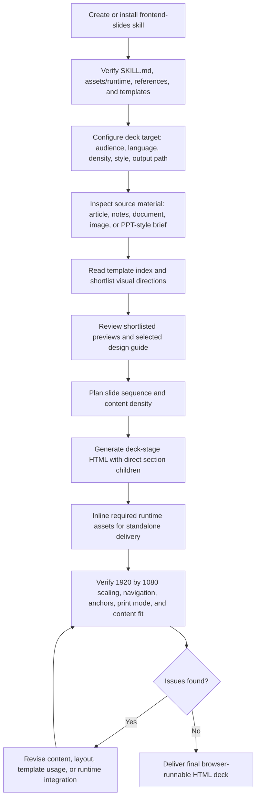
```mermaid
flowchart TD
  A[Create or install frontend-slides skill] --> B[Verify SKILL.md, assets/runtime, references, and templates]
  B --> C[Configure deck target: audience, language, density, style, output path]
  C --> D[Inspect source material: article, notes, document, image, or PPT-style brief]
  D --> E[Read template index and shortlist visual directions]
  E --> F[Review shortlisted previews and selected design guide]
  F --> G[Plan slide sequence and content density]
  G --> H[Generate deck-stage HTML with direct section children]
  H --> I[Inline required runtime assets for standalone delivery]
  I --> J[Verify 1920 by 1080 scaling, navigation, anchors, print mode, and content fit]
  J --> K{Issues found?}
  K -- Yes --> L[Revise content, layout, template usage, or runtime integration]
  L --> J
  K -- No --> M[Deliver final browser-runnable HTML deck]
```

Workflow steps:

1. Read `templates/selection-index.json` or `templates/templates.json` to shortlist candidates.
2. Read only shortlisted `preview.md` files; after choosing a direction, read the selected template's `design.md`.
3. Generate `<deck-stage width="1920" height="1080">` with direct `section` children.
4. Verify scaling, keyboard navigation, touch zones, right-side anchors, print behavior, and content fit.

## Skill Files

```text
skills/frontend-slides/
├── SKILL.md
├── prompt.md
├── assets/
│   ├── runtime-manifest.json
│   └── runtime/
├── templates/
│   ├── templates.json
│   ├── selection-index.json
│   └── <template-slug>/
│       ├── template.html
│       ├── preview.md
│       └── design.md
└── references/
```

## Template Gallery

Screenshots are generated from `tests/frontend-slides/<template>/index.html` and stored in `screenshots/frontend-slides/`.

### `8-bit-orbit`

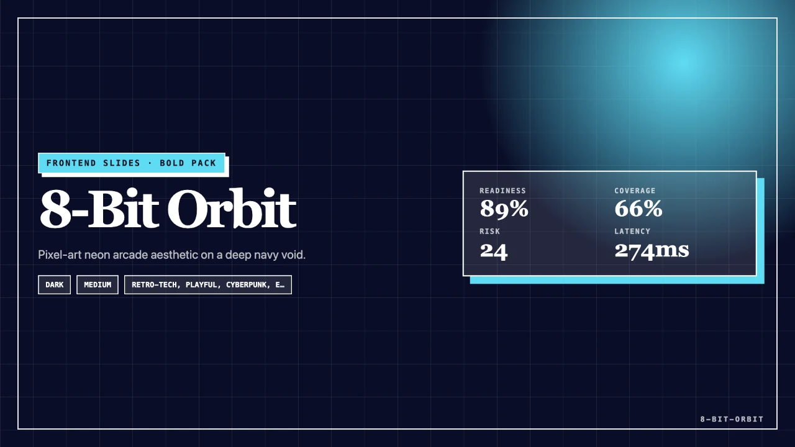

- Name: 8-Bit Orbit
- Tagline: Pixel-art neon arcade aesthetic on a deep navy void.
- Best for: Anything that should feel like a CRT screen at 2am: cyberpunk, gaming, web3, indie dev tools, hackathon demos. Just as good for a tech talk that wants to lean into nostalgic-digital craft, a synthwave brand deck, or a creative review that wants to feel like a console.

### `biennale-yellow`

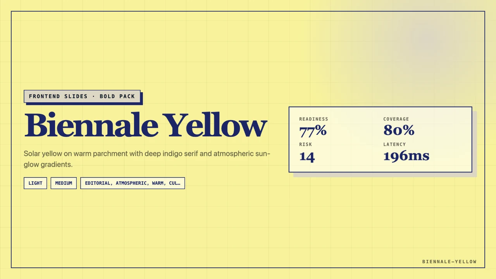

- Name: Biennale Yellow
- Tagline: Solar yellow on warm parchment with deep indigo serif and atmospheric sun-glow gradients.
- Best for: Anything that should feel like an art-biennale poster or a museum's annual programme: exhibition decks, arts-institution announcements, design conference brochures, curatorial pitches, literary publications, studio retrospectives. Equally good for any deck wanting Dutch-editorial atmosphere with an unmistakable single-color signature.

### `block-frame`

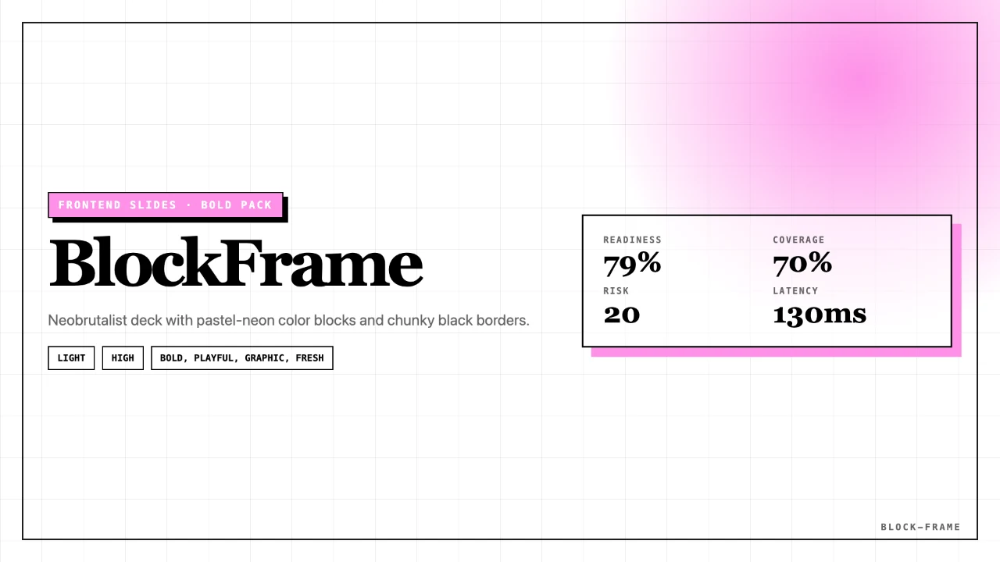

- Name: BlockFrame
- Tagline: Neobrutalist deck with pastel-neon color blocks and chunky black borders.
- Best for: Anything that should feel pop-graphic and design-led: indie SaaS launches, agency credentials, creative reviews, brand redesigns. Also a strong unexpected pick for tech, finance, or research when the speaker wants to land as confident and contemporary rather than buttoned-up.

### `blue-professional`

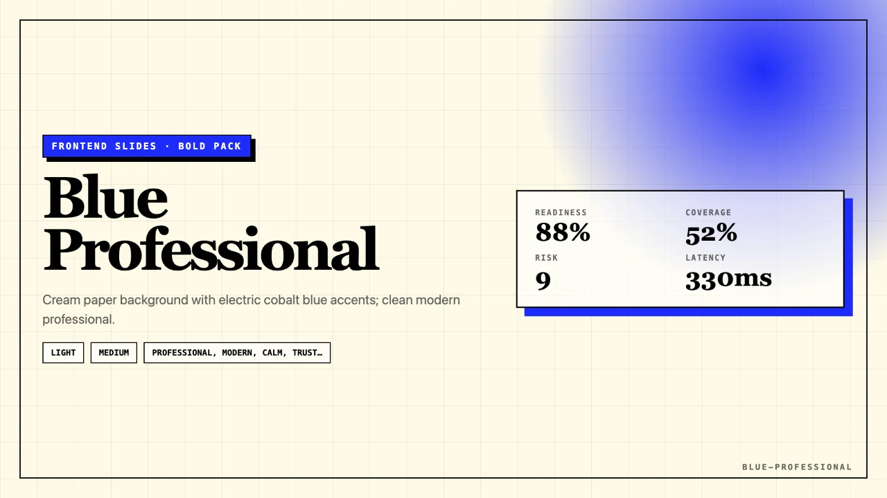

- Name: Blue Professional
- Tagline: Cream paper background with electric cobalt blue accents; clean modern professional.
- Best for: Anything that should feel modern-considered and lightly authoritative: B2B SaaS pitches, consulting deliverables, advisory updates, investor reports. Also a clean, tasteful choice whenever you want to read as professional without going stiff — research synthesis, internal reviews, brand work for service businesses.

### `bold-poster`

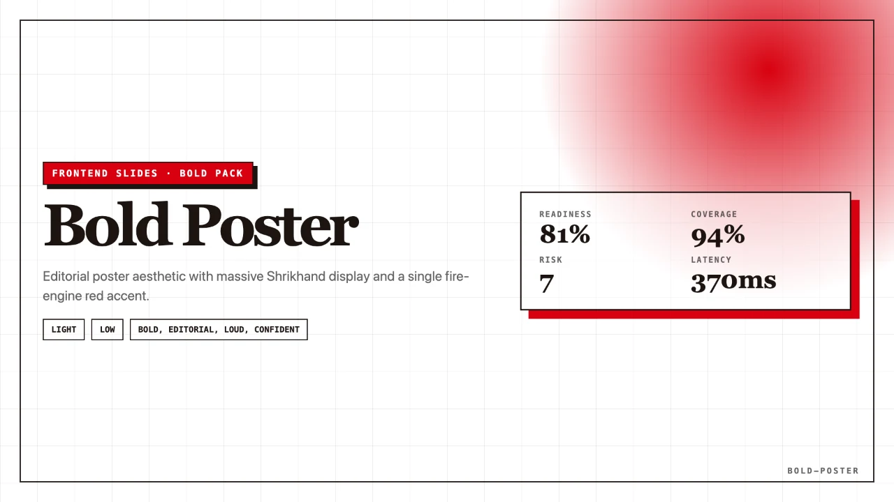

- Name: Bold Poster
- Tagline: Editorial poster aesthetic with massive Shrikhand display and a single fire-engine red accent.
- Best for: Anything that should land like a magazine cover: brand manifestos, founder vision decks, editorial / cultural pitches, creative reviews. Excellent any time you want a few words to feel like a poster — including unexpected fits like a tech keynote or a finance manifesto that wants to be quotable.

### `broadside`

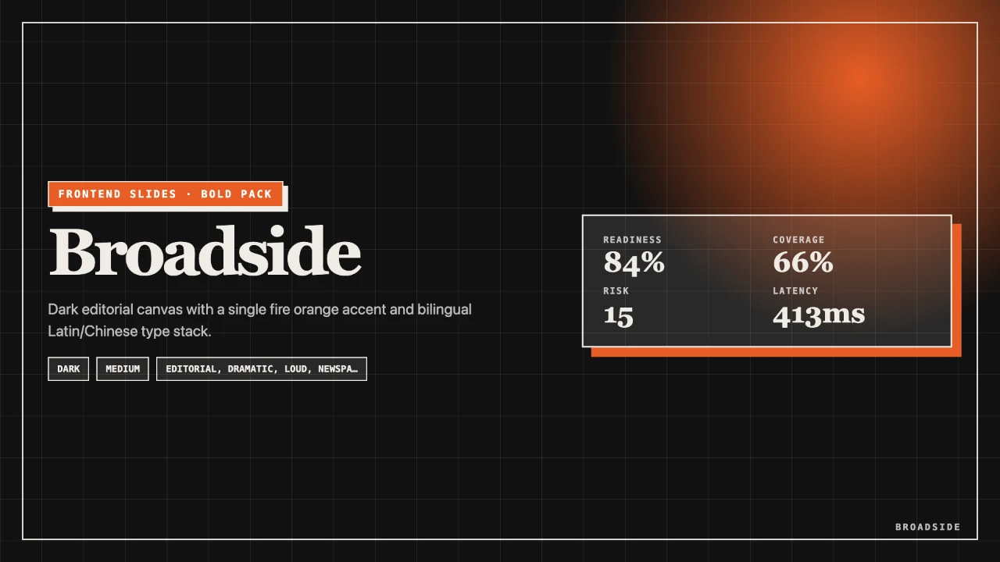

- Name: Broadside
- Tagline: Dark editorial canvas with a single fire orange accent and bilingual Latin/Chinese type stack.
- Best for: Anything that should land like a broadside newspaper headline: brand manifestos, magazine and cultural pitches, design talks, bilingual EN/CN decks, founder vision statements. Also a striking pick for tech, research, or business decks that want a dramatic single-accent editorial feel.

### `capsule`

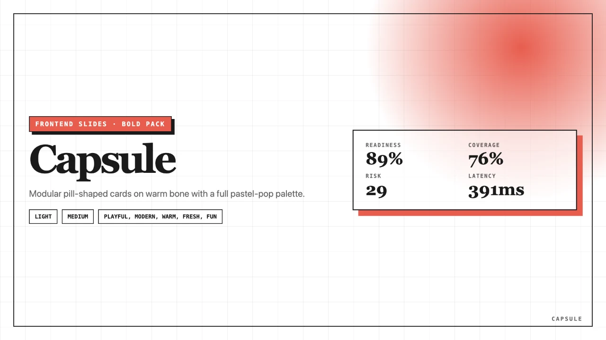

- Name: Capsule
- Tagline: Modular pill-shaped cards on warm bone with a full pastel-pop palette.
- Best for: Anything that should feel modular, modern, and a little Y2K: lifestyle brands, creator portfolios, DTC launches, beauty / wellness, agency credentials. Also fun for a playful tech demo or a research deck that wants pop-art clarity instead of gravitas.

### `cartesian`

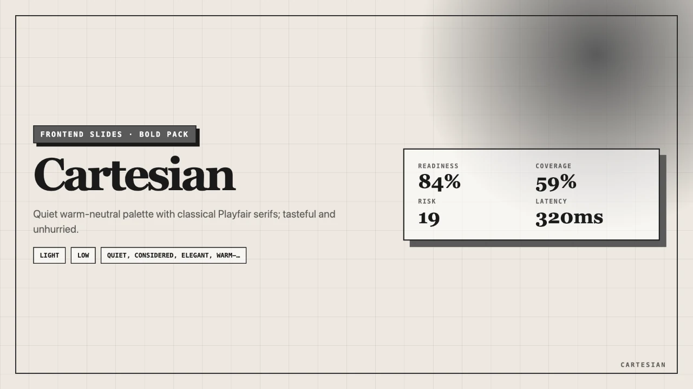

- Name: Cartesian
- Tagline: Quiet warm-neutral palette with classical Playfair serifs; tasteful and unhurried.
- Best for: Anything that should feel quiet, considered, and grown-up: investment theses, white papers, advisory work, longform research, gallery / cultural decks. Also a strong choice for editorial features, founder reflections, or any deck where restraint is the message — including across tech and finance.

### `cobalt-grid`

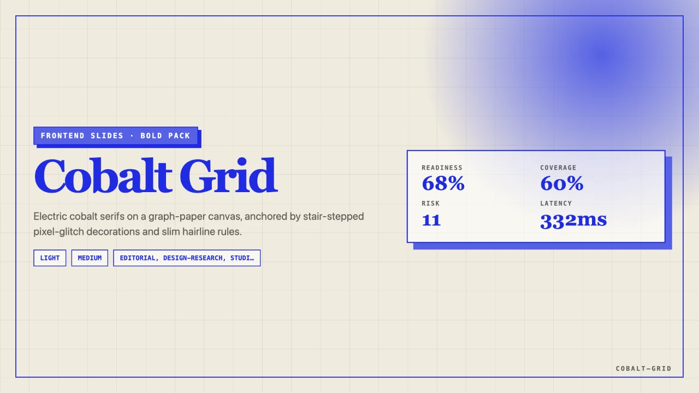

- Name: Cobalt Grid
- Tagline: Electric cobalt serifs on a graph-paper canvas, anchored by stair-stepped pixel-glitch decorations and slim hairline rules.
- Best for: Anything that should feel like a quietly serious design / research bulletin, art publication, or curated trend report. Strong for studio annuals, agency capabilities decks, design-research publications, architecture / art / academic decks, and any deck wanting one strict accent colour and a printed-ledger calmness rather than corporate polish.

### `coral`

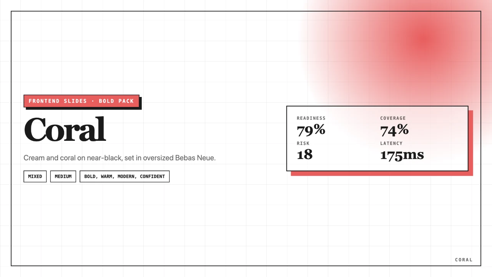

- Name: Coral
- Tagline: Cream and coral on near-black, set in oversized Bebas Neue.
- Best for: Anything that should feel warm-graphic and editorial: fashion, beauty, fitness, F&B, lifestyle brands, agency credentials. Just as strong for a creator portfolio, a manifesto, or a tech / research deck that wants warmth and a single bold accent instead of corporate cool.

### `creative-mode`

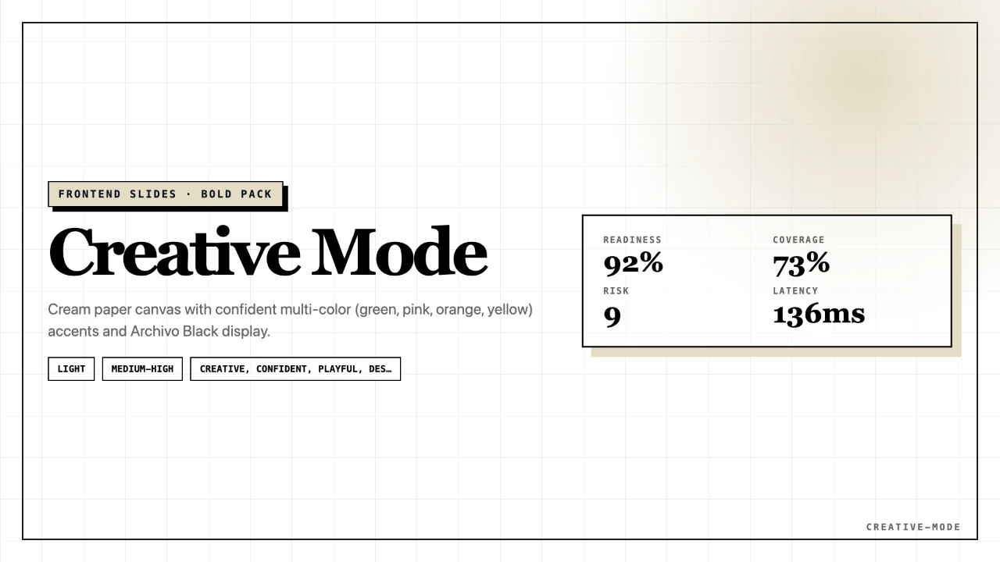

- Name: Creative Mode
- Tagline: Cream paper canvas with confident multi-color (green, pink, orange, yellow) accents and Archivo Black display.
- Best for: Anything that should feel design-led and confident: creative agency pitches, design studio decks, ad shop credentials, brand creative reviews, art-direction reviews. Also a great unexpected pick for a tech talk, research findings, or finance review when the speaker wants to lead with taste rather than convention.

### `daisy-days`

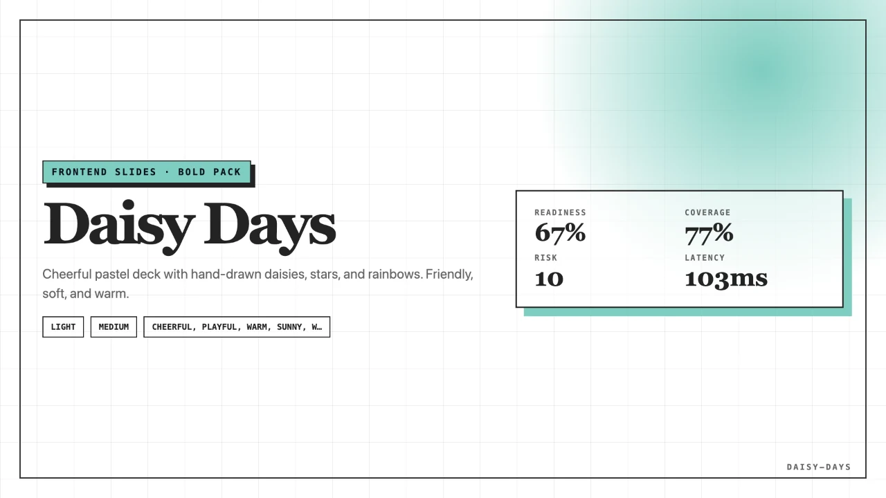

- Name: Daisy Days
- Tagline: Cheerful pastel deck with hand-drawn daisies, stars, and rainbows. Friendly, soft, and warm.
- Best for: Anything that should feel friendly, soft, and joyful: educational content, kids and family, wellness programs, community workshops, creator portfolios for craft / illustration. Also lovely for an unexpected playful internal kickoff, a wedding planning deck, or any moment where warmth is the message — including across tech or business contexts.

### `editorial-forest`

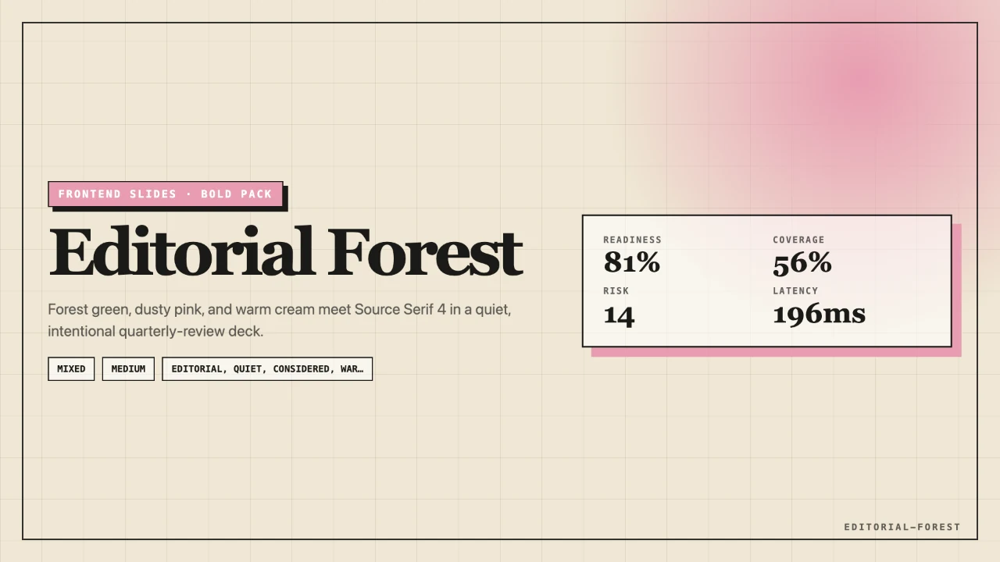

- Name: Editorial Forest
- Tagline: Forest green, dusty pink, and warm cream meet Source Serif 4 in a quiet, intentional quarterly-review deck.
- Best for: Anything that should feel like a considered editorial — quarterly reviews, internal readouts, studio updates, creative-agency presentations. Equally good for any deck that wants to feel warm and unhurried rather than corporate, including research recaps, book or program announcements, and team retrospectives.

### `editorial-tri-tone`

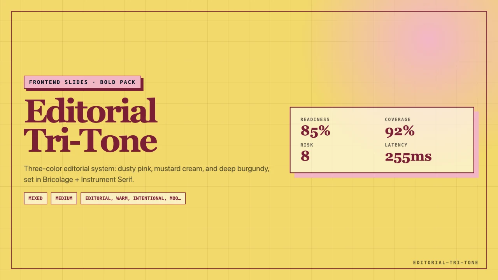

- Name: Editorial Tri-Tone
- Tagline: Three-color editorial system: dusty pink, mustard cream, and deep burgundy, set in Bricolage + Instrument Serif.
- Best for: Anything that should feel like a fashion-magazine spread: editorial pitches, fashion brand decks, lifestyle media, art direction reviews. Equally good for any deck — including tech, research, or business — that wants tri-tone discipline and serif/sans contrast instead of the usual neutrals.

### `emerald-editorial`

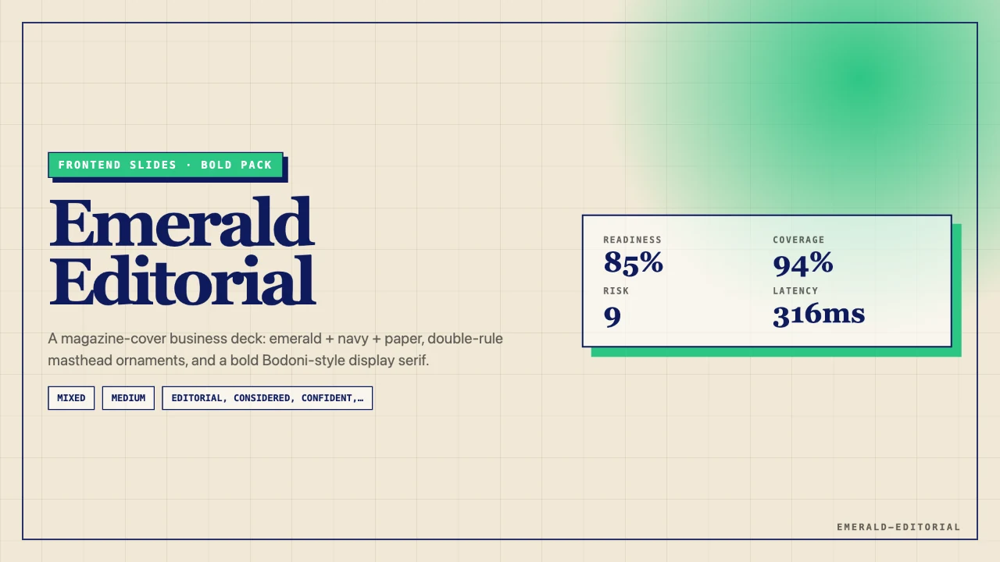

- Name: Emerald Editorial
- Tagline: A magazine-cover business deck: emerald + navy + paper, double-rule masthead ornaments, and a bold Bodoni-style display serif.
- Best for: Anything that should feel like the front of a serious magazine, including but not limited to leadership readouts, planning-office reviews, and strategy briefings. The double-rule masthead ornament gives it editorial gravitas without making it stiff — also a great unexpected pick for product launches or research recaps that want to feel considered rather than corporate.

### `grove`

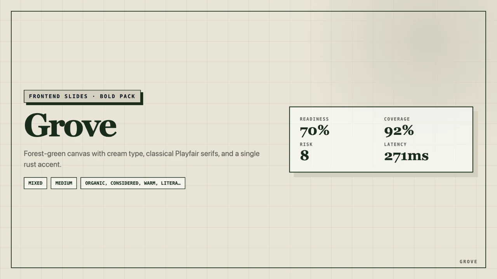

- Name: Grove
- Tagline: Forest-green canvas with cream type, classical Playfair serifs, and a single rust accent.
- Best for: Anything that should feel organic, considered, and grown-up: sustainability and wellness brands, outdoor / nature products, wineries and restaurants, literary or arts decks, advisory deliverables, bilingual EN/CN reports. Also a calm, distinctive choice for tech, research, or business decks that want patience over urgency.

### `long-table`

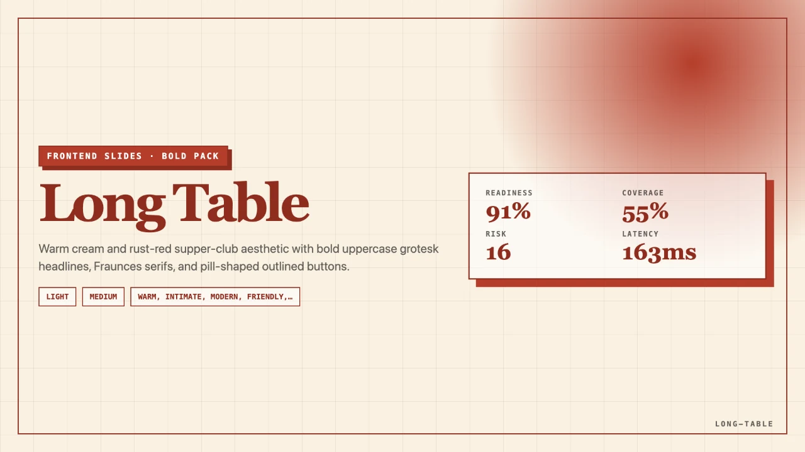

- Name: Long Table
- Tagline: Warm cream and rust-red supper-club aesthetic with bold uppercase grotesk headlines, Fraunces serifs, and pill-shaped outlined buttons.
- Best for: Anything that should feel like a warm, intimate, modern hospitality / community brand: supper clubs, dinner series, small restaurants, creative-studio events, membership pitches, lifestyle and wine brands. Equally good for any deck wanting a single warm accent colour, mixed-weight typography, and a social-media-aware modern-editorial voice.

### `mat`

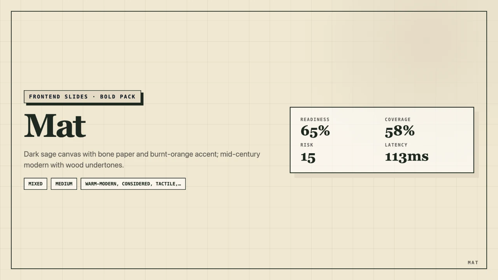

- Name: Mat
- Tagline: Dark sage canvas with bone paper and burnt-orange accent; mid-century modern with wood undertones.
- Best for: Anything that should feel mid-century, tactile, and intentional: design studio credentials, architecture / interior brands, ceramics / craft / furniture, advisory decks. Also a warm, distinctive choice for tech, research, or business decks that want a considered analog feel instead of digital-cool.

### `monochrome`

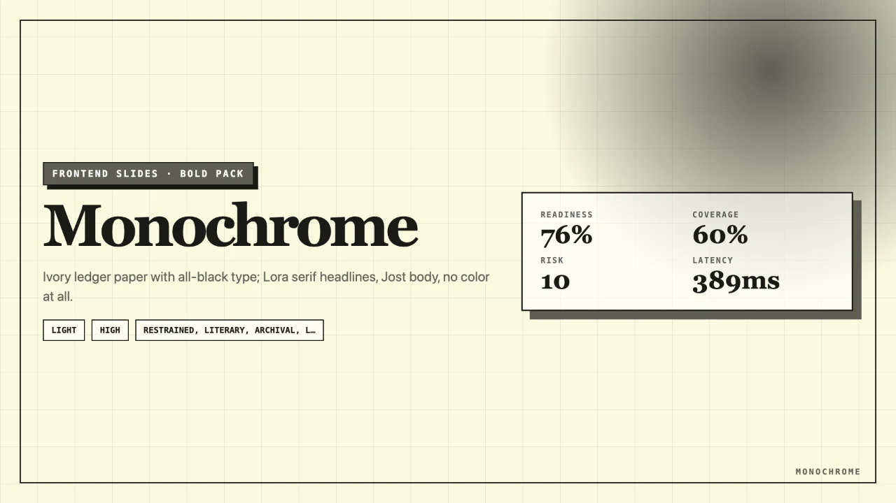

- Name: Monochrome
- Tagline: Ivory ledger paper with all-black type; Lora serif headlines, Jost body, no color at all.
- Best for: Anything that should feel like a hand-typeset ledger: user research synthesis, white papers, longform reports, academic and policy briefs, advisory deliverables, bilingual EN/CN reports. Equally good for tech, design, or brand decks that want their words to be the only thing on the page.

### `neo-grid-bold`

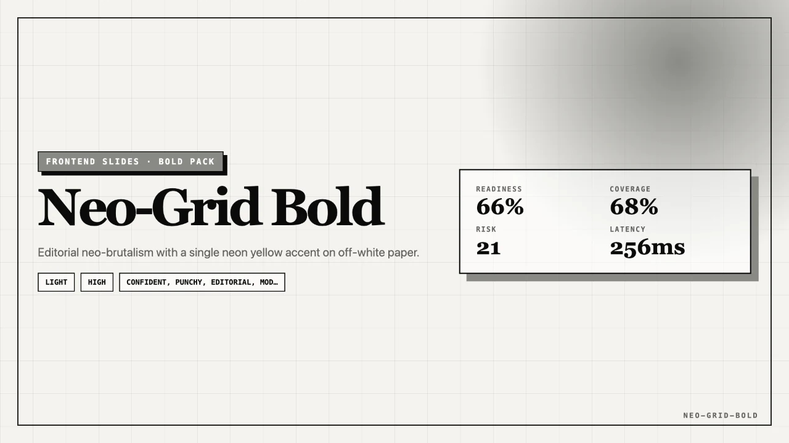

- Name: Neo-Grid Bold
- Tagline: Editorial neo-brutalism with a single neon yellow accent on off-white paper.
- Best for: Anything that should feel confident and editorial-graphic: design-led pitches, brand work, founder talks, conference keynotes. Excellent for stat-heavy slides, comparisons, and process flows. Just as strong for tech, research, or finance when the speaker wants to read as design-led rather than corporate.

### `peoples-platform`

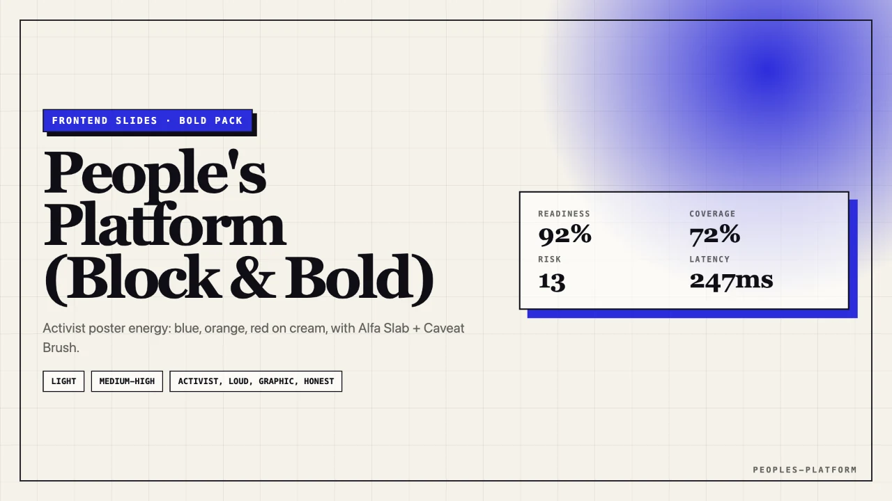

- Name: People's Platform (Block & Bold)
- Tagline: Activist poster energy: blue, orange, red on cream, with Alfa Slab + Caveat Brush.
- Best for: Anything that should feel honest, loud, and graphic: cultural commentary, manifestos, civic and community decks, design talks, campaign pitches. Excellent for founder-vision moments, mission statements, or any deck — including across industries — that wants protest-poster energy instead of corporate polish.

### `pin-and-paper`

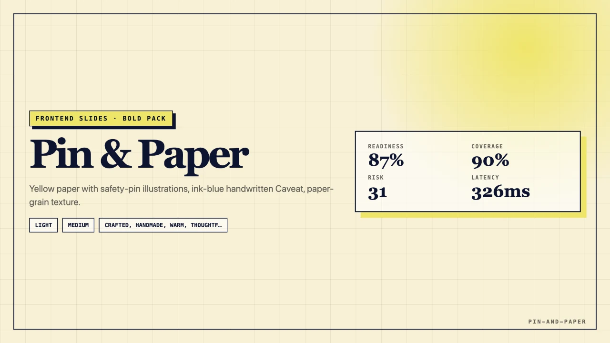

- Name: Pin & Paper
- Tagline: Yellow paper with safety-pin illustrations, ink-blue handwritten Caveat, paper-grain texture.
- Best for: Anything that should feel hand-crafted, warm, and literary: qualitative research findings, founder reflections, longform brand stories, workshop debriefs. The signature safety-pin illustrations and paper-grain texture make it especially good for any deck — including tech or business — that wants personality and warmth over polish.

### `pink-script`

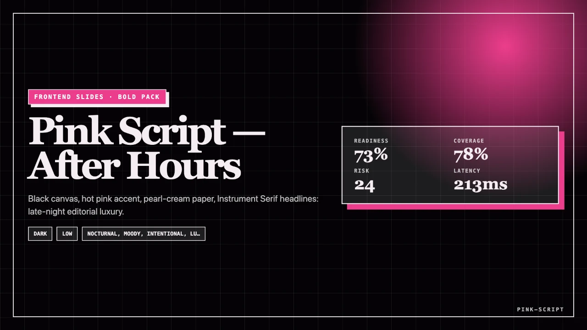

- Name: Pink Script — After Hours
- Tagline: Black canvas, hot pink accent, pearl-cream paper, Instrument Serif headlines: late-night editorial luxury.
- Best for: Anything that should feel nocturnal, intentional, and a little luxe: fashion brand decks, creator personal brands, after-hours / nightlife / spirits launches, luxury product reveals, editorial features. Also a striking unexpected pick for a tech keynote, research synthesis, or business pitch that wants to land with magnetic confidence.

### `playful`

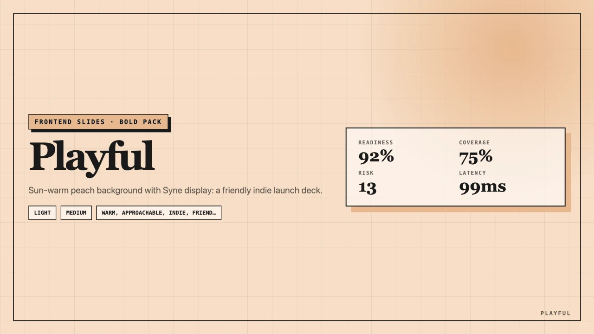

- Name: Playful
- Tagline: Sun-warm peach background with Syne display: a friendly indie launch deck.
- Best for: Anything that should feel warm, indie, and approachable: creator portfolios, indie product launches, lifestyle brands, small-business pitches, newsletter / community decks. Also welcoming for any deck — including tech or research — that wants to feel friendly and human rather than corporate.

### `raw-grid`

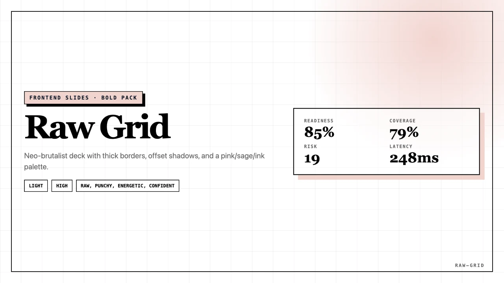

- Name: Raw Grid
- Tagline: Neo-brutalist deck with thick borders, offset shadows, and a pink/sage/ink palette.
- Best for: Anything that should feel direct and graphic-confident: founder pitches, accelerator demos, brand decks, indie launches, creator portfolios. Strong for stat slides, comparison tables, and process flows. Equally good for tech, research, or finance when the speaker wants the deck to feel scrappy-confident rather than buttoned-up.

### `retro-windows`

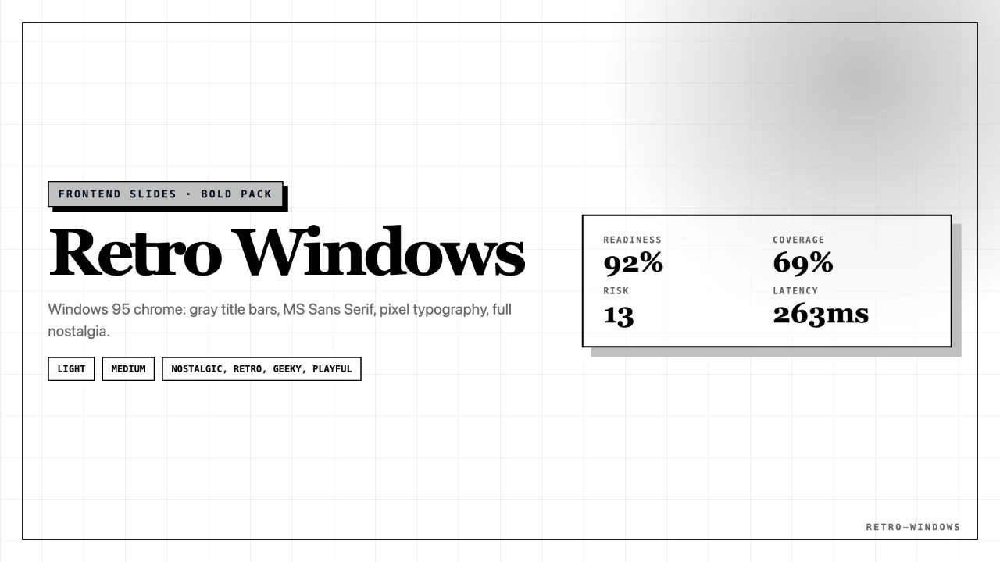

- Name: Retro Windows
- Tagline: Windows 95 chrome: gray title bars, MS Sans Serif, pixel typography, full nostalgia.
- Best for: Anything that should feel knowingly nostalgic: retro gaming, Y2K-aesthetic brands, creator portfolios with a 90s vibe, tech-history talks, deliberately tongue-in-cheek decks. A great choice anywhere a playful retro reference is the entire point.

### `retro-zine`

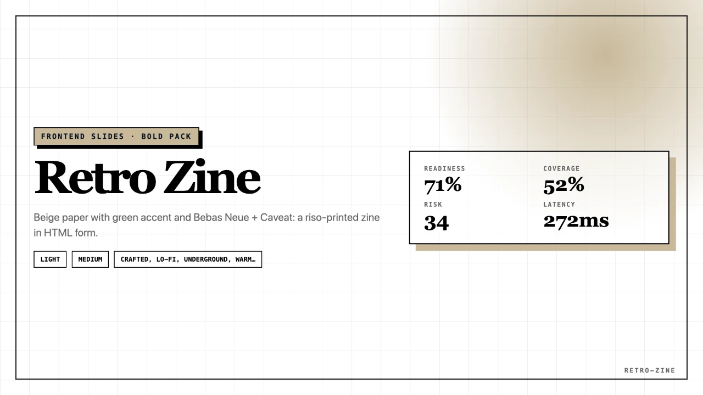

- Name: Retro Zine
- Tagline: Beige paper with green accent and Bebas Neue + Caveat: a riso-printed zine in HTML form.
- Best for: Anything that should feel printed, lo-fi, and crafted: indie zines and publications, music / arts brands, creator portfolios, small-batch craft launches, community decks. Also a great underdog choice for tech, research, or business decks that want a riso-print warmth instead of digital polish.

### `sakura-chroma`

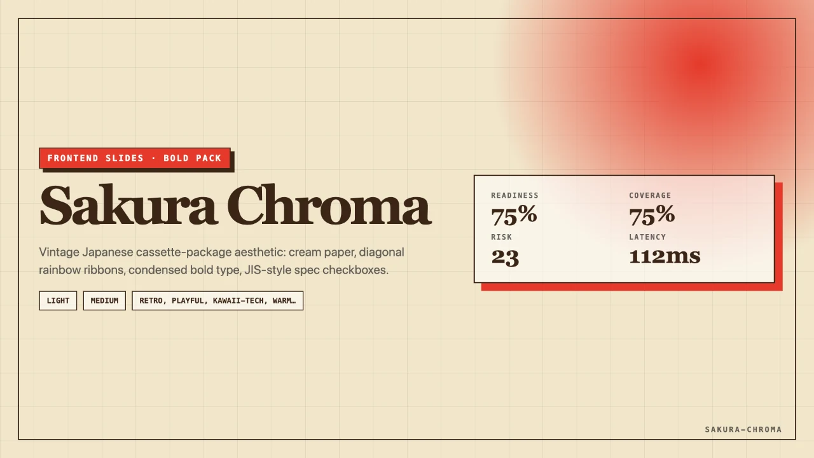

- Name: Sakura Chroma
- Tagline: Vintage Japanese cassette-package aesthetic: cream paper, diagonal rainbow ribbons, condensed bold type, JIS-style spec checkboxes.
- Best for: Anything that should feel like a vintage Japanese cassette package or a TDK / Sony / Sakura Color product catalogue: indie hardware brand decks, music-label release schedules, analog studio retrospectives, zine and magazine pitches, kawaii-tech product launches, creative-studio annual reports. Equally good for any deck wanting bold colour, condensed display type, and a tactile printed-product personality.

### `scatterbrain`

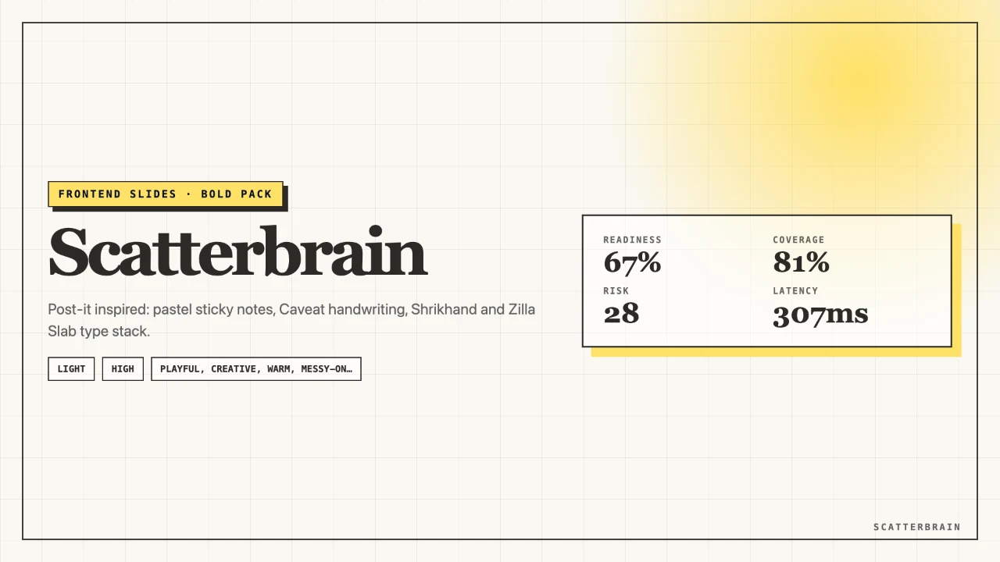

- Name: Scatterbrain
- Tagline: Post-it inspired: pastel sticky notes, Caveat handwriting, Shrikhand and Zilla Slab type stack.
- Best for: Anything that should feel like a designer's whiteboard: brainstorms, workshops, creative-agency credentials, design-thinking sessions, ideation pitches, art-direction reviews. Equally fun for any deck — including tech, research, or business — that wants to read as in-progress thinking rather than polished conclusions.

### `signal`

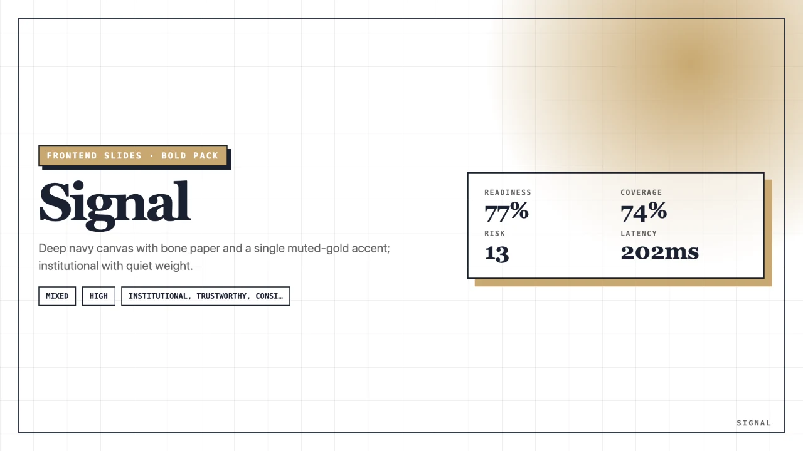

- Name: Signal
- Tagline: Deep navy canvas with bone paper and a single muted-gold accent; institutional with quiet weight.
- Best for: Anything that should feel weighty, considered, and credibly institutional: investor decks, board presentations, consulting deliverables, legal / policy briefs, advisory pitches. Also a strong choice for tech, research, or brand work that wants to read as quietly authoritative rather than loud.

### `soft-editorial`

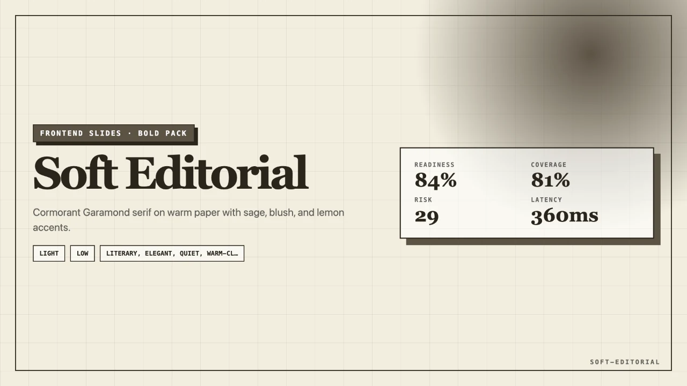

- Name: Soft Editorial
- Tagline: Cormorant Garamond serif on warm paper with sage, blush, and lemon accents.
- Best for: Anything that should feel literary, elegant, and unhurried: editorial features, longform brand stories, gallery / museum decks, advisory deliverables, wedding / lifestyle media, founder essays. Equally good for tech, research, or business decks that want a Sunday-supplement warmth instead of corporate polish.

### `stencil-tablet`

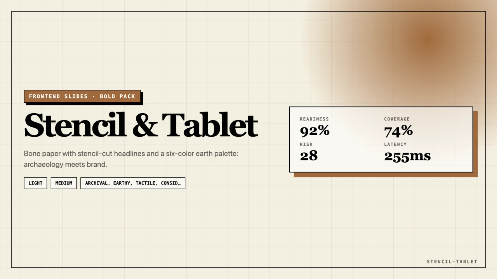

- Name: Stencil & Tablet
- Tagline: Bone paper with stencil-cut headlines and a six-color earth palette: archaeology meets brand.
- Best for: Anything that should feel archival, tactile, and weighty-graphic: museum and cultural-institution decks, art / architecture brands, longform research, heritage and craft brands, manifestos. A great choice anytime — including across tech and business — when you want the deck to feel like a field manual rather than a slide deck.

### `studio`

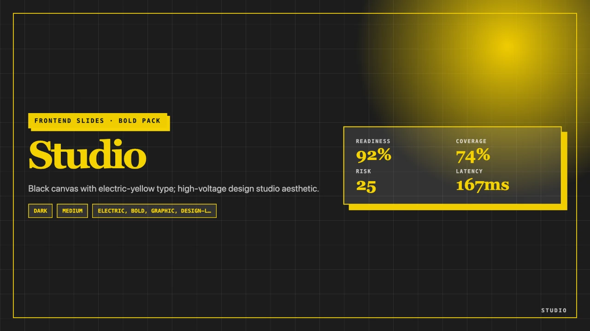

- Name: Studio
- Tagline: Black canvas with electric-yellow type; high-voltage design studio aesthetic.
- Best for: Anything that should feel electric and design-led: studio credentials, creative agency pitches, brand showcases, art-direction reviews, fashion / sneaker brand work. Also a striking unexpected choice for tech, research, or business decks where the speaker wants the deck to *be* a brand statement.

### `vellum`

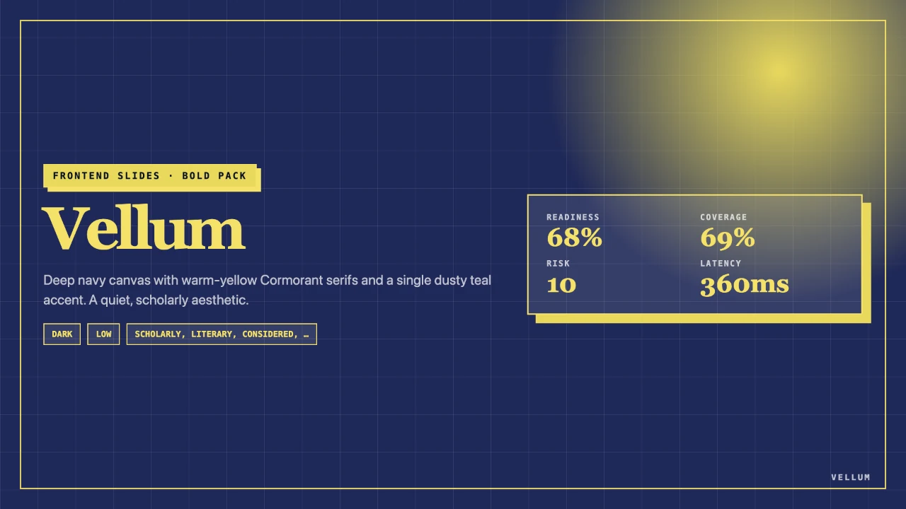

- Name: Vellum
- Tagline: Deep navy canvas with warm-yellow Cormorant serifs and a single dusty teal accent. A quiet, scholarly aesthetic.
- Best for: Anything that should feel scholarly, literary, and quietly intelligent: research synthesis, white papers, academic and policy briefs, advisory deliverables, longform editorial pieces, founder reflections. Equally strong for any deck — including tech, business, or creator work — that wants a calm, considered atmosphere instead of energetic visuals.

## Updating Screenshots

When templates change, regenerate screenshots from the test fixtures at 1280×720 and save them as WebP files under `screenshots/frontend-slides/`. Keep screenshot filenames aligned with template slugs.
