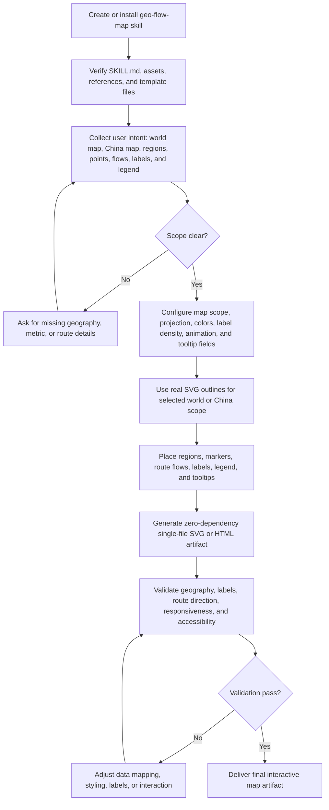

# Geo Flow Map

Generates single-file, zero-dependency interactive SVG geographic maps from user intent and geospatial visualization requirements.

## Install

Install this skill directly from the Chaos Design Skills repository:

```bash
npx skills add https://github.com/chaos-design/skills --skill geo-flow-map
```

## End-to-End Processing Flow

`geo-flow-map` translates geospatial visualization intent into a single-file interactive SVG map. The full process starts with skill creation or installation, then confirms geographic scope, configures map data and visual rules, renders the SVG, and validates geographic accuracy and interaction behavior.



1. Install or copy the skill with its `SKILL.md`, references, and visual assets intact.
2. Confirm whether the user needs a world map, China map, regional view, point map, route-flow map, or mixed visualization.
3. Configure map scope, data fields, colors, label strategy, tooltip fields, animation style, and output location.
4. Render with real SVG outlines rather than placeholder shapes, then add markers, flows, labels, legends, and tooltips.
5. Validate that regions and routes are geographically correct, labels remain legible, direction lines match the source data, and the artifact runs without external dependencies.

## Example

Ask the agent to create a world or China SVG map with real outlines, location markers, regional boundaries, route flows, animated direction lines, labels, legends, tooltips, and map-scope inference.
