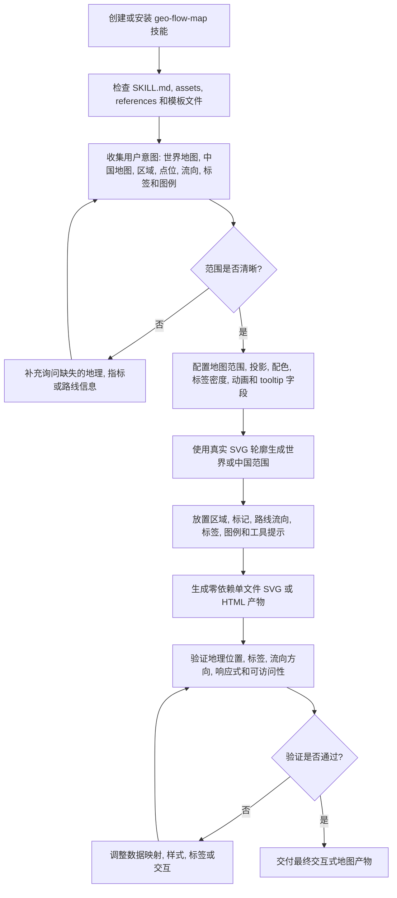

# Geo Flow Map

根据用户意图和地理可视化需求生成单文件、零依赖的交互式 SVG 地理地图。

## 安装

可以直接从 Chaos Design Skills 仓库安装该 Skill：

```bash
npx skills add https://github.com/chaos-design/skills --skill geo-flow-map
```

## 完整处理流程

`geo-flow-map` 会把地理空间可视化意图转换为单文件交互式 SVG 地图。完整流程从创建或安装技能开始，随后确认地理范围，配置地图数据和视觉规则，渲染 SVG，并验证地理准确性与交互行为。



1. 安装或复制技能，并保持 `SKILL.md`、参考文档和视觉资源完整。
2. 确认用户需要世界地图、中国地图、区域图、点位图、路线流向图，还是混合型可视化。
3. 配置地图范围、数据字段、配色、标签策略、工具提示字段、动画风格和输出位置。
4. 使用真实 SVG 轮廓渲染地图，不使用占位形状，再添加点位、流向、标签、图例和工具提示。
5. 校验区域和路线是否地理准确、标签是否清晰、方向线是否匹配来源数据，以及产物是否无外部依赖运行。

## 示例

让智能体生成世界地图或中国地图的真实 SVG 轮廓图，并根据意图绘制地点标注、区域边界、流向路线、方向动画、标签、图例、工具提示和地图范围自动判断。
