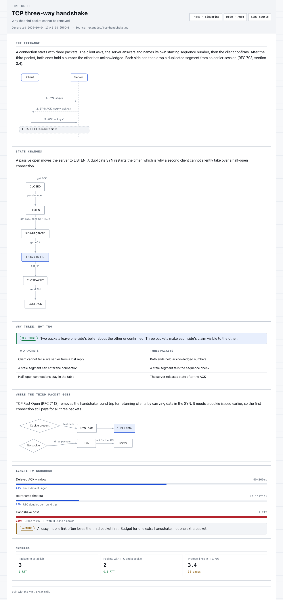
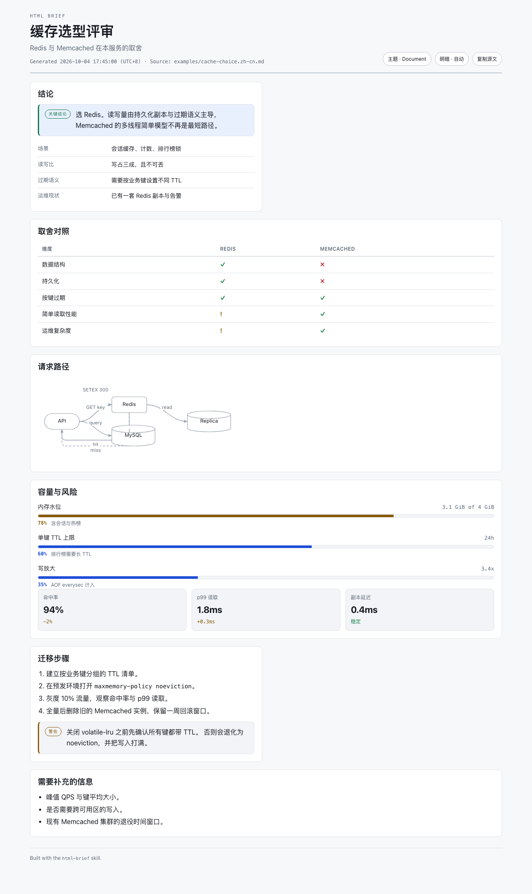

# HTML Brief 简报生成

[English](./README.md)

把复杂答案变成一页人能读懂的 HTML。Agent 只写一份很短的 Markdown 草稿，渲染器负责版面、图形坐标、标签换行、主题和明暗切换。



## 为什么不直接让模型写 HTML

直接要求 HTML，模型就要逐行输出每个容器、每条 CSS 规则和每个 SVG 坐标。输出 token 同时也是读者等待的时间。

用这个 Skill，模型只写内容。一份简报通常只需要几百个输出 token 的草稿，剩下的由渲染器完成。标签位置、箭头走向和网格分栏都是计算出来的，不是猜出来的。

## 你问什么，就得到什么

| 你问 | 得到 |
| --- | --- |
| 「解释 TCP 三次握手」 | 时序图、状态流程图和对比表 |
| 「梳理这个仓库里各 skill 之间的关系」 | 流水线流程图、目录树和事实表 |
| 「缓存选 Redis 还是 Memcached」 | 带 ✓ ✗ ! 的对比表、请求流程图、容量限制和迁移步骤 |
| 「TCP 拥塞控制是怎么演进的」 | 时间线、对比表和恢复循环图 |
| 「这段文字有什么问题」 | 逐词标注，并给出每处的问题原因 |
| 「`ls` 怎么看隐藏文件」 | 不生成页面。一行问题得到一行答案 |

Agent 会自己判断值不值得做一页：相互关联的概念、多步流程、多方对比、历史、需要参照系的数字。也可以直接说「用 HTML 简报解释一下」。

## 安装

```bash
npx skills add https://github.com/chaos-design/skills --skill html-brief
```

不需要 `npm install`，也不需要 `pip install`。渲染器只用 Python 3 标准库，随 Skill 一起分发。

## 在 Agent 中使用

```bash
cd skills/html-brief

# 渲染草稿
python3 scripts/html_brief.py render draft.md --out brief.html

# 只看文字检查结果
python3 scripts/html_brief.py check draft.md

# 渲染全部内置示例，并校验页面保持自包含
python3 scripts/html_brief.py validate --out-dir out

# 校验页面语义：结构、语言、标注、图形顺序仍与草稿一致（无需浏览器）
python3 scripts/check_semantics.py

# 用本机 Chrome 验证图内标签没有被裁切（不写入任何文件）
python3 scripts/check_layout.py
```

`html_brief.py` 也接受裸路径作为 `render` 的简写，`-` 表示从标准输入读取草稿：

```bash
cat draft.md | python3 scripts/html_brief.py render - --out brief.html
```

常用参数：

| 参数 | 含义 |
| --- | --- |
| `--theme blueprint\|document` | 覆盖 front matter；blueprint 是工程图纸风格，document 是编辑备忘录风格 |
| `--mode auto\|light\|dark` | 初始明暗模式 |
| `--lang auto\|en\|zh\|ja` | 按钮文案、标注标签和 `<html lang>` |
| `--columns 1\|2` | 栅格列数 |
| `--out-dir DIR` | 输出到目录下的 `<slug>.html`，而不是单个文件 |
| `--date 'YYYY-MM-DD HH:MM:SS'` | 固定 UTC+8 时间戳，便于复现 |
| `--no-date` | 完全省略时间戳 |
| `--check off\|warn\|strict` | 文字检查；`strict` 会在存在问题时拒绝渲染 |
| `--open` | 写完后用浏览器打开 |
| `--force` | 直接覆盖，而不是写成 `name-2.html` |

## 草稿格式

```markdown
---
title: TCP 三次握手
subtitle: 第三个包为什么不能省
theme: blueprint
---

## 报文交换 {span=2}

```sequence num
Client -> Server: SYN, seq=x
Server -.-> Client: SYN+ACK, seq=y, ack=x+1
Client -> Server: ACK, ack=y+1
```

## 状态变化

```flow TB
(CLOSED) -> LISTEN: passive open
LISTEN -> SYN-RECEIVED: get SYN
SYN-RECEIVED -> *ESTABLISHED*: get ACK
```
```

每个 `##` 是一个面板，`{span=2}` 表示占满整行，其余都是普通 Markdown。完整规范（节点形状、分组、分支片段以及全部错误信息）见
[references/draft-format.md](./references/draft-format.md)。

## 组件

| 组件 | 适用场景 |
| --- | --- |
| `flow LR` / `flow TB` | 架构、请求链路、状态机、分支决策 |
| `sequence` | 参与方之间随时间交换的消息，支持 note、激活条和 `alt` / `else` 分支 |
| `tree` | 目录结构、模块划分、分类体系 |
| `timeline` | 版本、阶段、历史 |
| `limits` | 数值与上限的对比 |
| `stat` | 带方向的关键数字 |
| `kv` | 元数据与标题栏 |
| `annot` | 逐词审阅一句话 |
| 表格 | 多方对比；`ok` / `no` / `warn` 会渲染成 ✓ ✗ ! |
| 标注块 | `> note:`、`> tip:`、`> warn:`、`> danger:`、`> key:` |

版面由代码计算：节点尺寸来自标签文本宽度测量，分层顺序经过交叉数优化，回边单独走泳道，标签自动换行以避免重叠。



## 页面包含什么

- 单个 `.html` 文件，没有 CDN、没有网络字体、没有远程图片、没有依赖。
- 页眉显示标题、副标题、UTC+8 时间戳和来源路径。
- 工具栏可切换主题、循环切换亮色 / 深色 / 自动，并复制源草稿；选择保存在 `localStorage`。
- 草稿内嵌在页面里，源文随时可取回。
- 图形为 SVG，带 `<title>` 和 `aria-label`。
- 打印样式会隐藏工具栏并保持面板完整。
- 宽度低于 880px 时变为单栏，图形横向滚动而不是溢出。

## 文字检查

规则改编自 [ASD-STE100](https://www.asd-ste100.org/)——航空维修手册使用的受控英语。只检查机器能判断的部分：

- 句子长度：英文 25 词，中文 45 字
- 段落长度：6 句
- 英文被动语态
- 冗余表达，如 *in order to*、*prior to*、*utilize*
- 中文空动词，如「进行优化」
- 一句里出现三个以上「的」
- 「赋能」「闭环」这类套话

默认只警告。简报对外分享前用 `--check strict` 作为闸门。

## 示例

| 草稿 | 展示内容 |
| --- | --- |
| `examples/tcp-handshake.md` | 带 note 的时序图、状态流程、对比表、容量限制 |
| `examples/skill-pipeline.md` | 宽幅流水线流程图、目录树、归属信息 |
| `examples/congestion-control-history.md` | 带高亮条目的时间线、对比表、恢复循环 |
| `examples/cache-choice.zh-cn.md` | 中文简报：结论、对比表、流程图、容量、迁移步骤 |
| `examples/writing-check.md` | 逐词标注、问题统计与修复流程 |

一次渲染全部示例：

```bash
python3 scripts/html_brief.py examples --out-dir out
```

## 校验

```bash
# 渲染全部示例，检查 doctype、内联样式、内嵌源文，并确认没有任何外链 URL
python3 scripts/html_brief.py validate --out-dir out

# 用独立的小解析器从草稿反推期望结构，再与渲染结果逐项比对
python3 scripts/check_semantics.py

# 用无头 Chrome 渲染全部示例；任一图内标签超出 viewBox 或页面出现横向滚动都会失败
python3 scripts/check_layout.py
```

`check_semantics.py` 检查的是"说得对不对"，而不只是"坏没坏"。它自带一个小解析器，
从每份草稿反推期望值再逐项比对：

| 校验项 | 能抓出的问题 |
| --- | --- |
| 内嵌源文与草稿逐字节一致 | 转义或截断 |
| 面板数量与标题对应草稿的 `##` 行 | 面板或其标题丢失 |
| 显式 `lang:` 生效 | front matter 被忽略 |
| 工具栏与标注语言与页面语言一致 | 英文页配中文控件 |
| 仅当引用有两段时才出现 callout 标题 | 标题掉回正文 |
| 每个 `ok` / `no` / `warn` 单元格生成一个符号 | 对比列丢失 |
| 每行 limits 生成对应百分比的进度条 | 进度条数字错误 |
| 时序图参与者按首次出现顺序排列 | 泳道顺序错误 |
| 每张图都有 title、aria-label 与 viewBox | 图形失去可访问名称 |
| 同一草稿两次渲染结果一致 | 隐藏的不确定性 |
| 单次渲染不超过时间预算 | 用秒级耗时换取毫秒级美化的改动 |
| 内嵌源文原样还原，且任何闭合标签变体都无法逃逸 | 草稿变成可执行标记 |

脚本内还有一份小快照，固定每份示例的标题、语言、面板数与图形类型，改动必须显式确认。

`check_layout.py` 需要本机的 Chrome、Edge 或 Chromium。找不到浏览器时它会报告跳过并以 0 退出，不会假装通过。

两个检查脚本都只写入临时目录，不改动仓库。

## 已知限制

- 图形几何基于文本宽度估算，而不是字体度量。估算已留余量，并由 `check_layout.py` 在浏览器中实测。与系统字体差异很大的字体栈可能让标签偏移一两像素。
- 只使用系统字体，这是刻意的：不发起网络字体请求的页面，读者无法改字体。
- 一页一种语言。中英混排草稿可以正常渲染；按钮文案跟随 `lang`。
- 文字检查只管文字，不判断图示是否正确。

## 目录结构

```text
skills/html-brief/
  SKILL.md
  README.md
  README.zh-CN.md
  manifest.json
  LICENSE
  examples/            五份完整草稿
  references/          草稿格式与撰写指南
  scripts/
    html_brief.py      命令行入口
    check_semantics.py 语义校验：结构、语言、标注、图形顺序
    check_layout.py    无头浏览器版面检查
    briefkit/          解析、图形、块、主题、渲染、检查
tests/html-brief/      生成预览，每个示例一个目录
screenshots/html-brief/
```

## 许可证

Apache-2.0，与本仓库其余部分一致，见 [LICENSE](./LICENSE)。