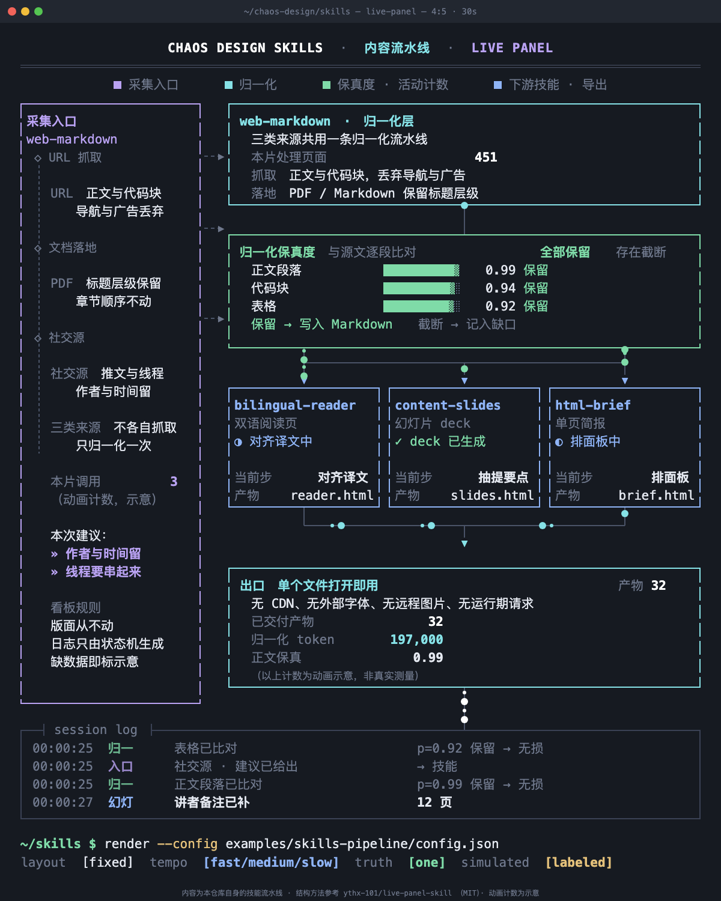
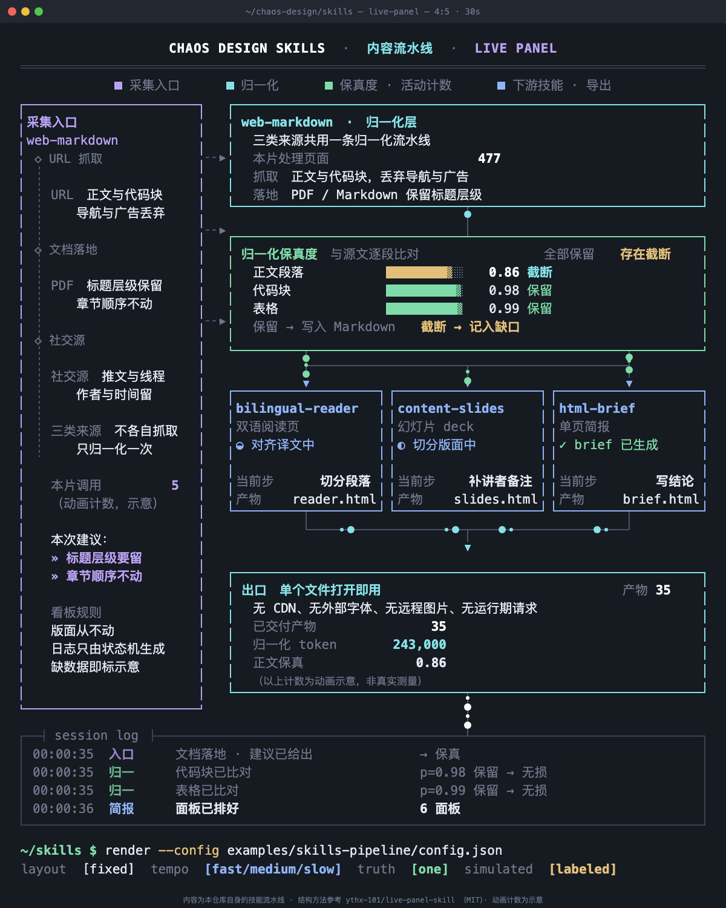

# Live Panel

[English](./README.md)

把一份"正在运行的系统"的描述变成一块**一直在运行的看板**：版面不动，连线上有光点流动，
日志滚动，计数跳动，进度条过阈值翻状态，侧栏触发点依次点亮。产出 H.264 mp4（适合发 X 和
小红书），或一个可直接打开的网页。



## 你说什么，拿到什么

| 你说 | 拿到 |
| --- | --- |
| "把请求怎么流过我们服务动起来" | 版面固定的架构看板，每根线上都有光点，一个 mp4 |
| "这张系统图要发 X，做得 alive 一点" | 同一块看板，按帖子比例裁切，30 fps 渲染 |
| "一个先规划、再分叉、会复审的 agent 循环" | 带仪表条、触发栏、逐字打出的建议和会话日志的方框 |
| "给我们文档站一个活的架构页" | 单个自包含 HTML 文件，无依赖 |
| "解释一下这个流水线" | 不产出。用散文回答，除非你要的是会动的看板 |

agent 只写一个 JSON 文件。渲染器负责算光点、算计数、算状态变化和日志，然后逐帧驱动一个真实
浏览器。

## 为什么不让模型直接做视频

让模型做视频，它得先画图、再描述动作、然后指望两者对得上。没有人检查结果，于是光点数量和计
数对不上，日志里的数字和进度条上显示的不是一个数。

这里版面从不动，而且**每一个视觉元素都是 `t` 的纯函数**——没有挂钟、没有 `Math.random()`、没有
CSS 动画。正是这一条约束让结果可被检查：检查器可以跳到任意时刻，读同一时刻，然后比对。

## 安装

```bash
npx skills add https://github.com/chaos-design/skills --skill live-panel
```

只要 Python 3.8+ 标准库，不需要 pip 包。检查和出视频需要 Chrome 或 Chromium，出视频还需要
ffmpeg。生成网页两者都不需要。

## 使用

```bash
cd skills/live-panel

# 只看配置，不渲染任何东西
python3 scripts/build_page.py examples/skills-pipeline/config.json --print

# 自包含网页：不需要浏览器，不需要 ffmpeg
python3 scripts/build_page.py examples/skills-pipeline/config.json --out page.html

# 在约 120 个时刻量版面，并导出 PNG
python3 scripts/check_frames.py --config examples/skills-pipeline/config.json --out-dir frames

# 抓出没填上的 {变量}，或日志里面板上并不存在的数字
python3 scripts/check_truth.py --config examples/skills-pipeline/config.json

# 出 mp4
python3 scripts/render.py --config examples/skills-pipeline/config.json --out panel.mp4
```

常用参数：

| 参数 | 脚本 | 含义 |
| --- | --- | --- |
| `--out DIR` | `check_frames.py` | PNG 输出目录 |
| `--samples N` | 两个检查器 | 读取多少个时刻；90 以上才算真检查 |
| `--repeat` | `check_frames.py` | 跳走再跳回，证明该帧逐字节相同 |
| `--png N` | `check_frames.py` | 导出多少张 PNG |
| `--keep-frames DIR` | `render.py` | 额外保留视频用到的每一帧 PNG |
| `--html-out page.html` | `render.py` | 把自包含网页留在 mp4 旁边 |
| `--duration`、`--fps`、`--crf` | `render.py` | 覆盖配置里的画幅设置 |
| `--chrome`、`--ffmpeg` | 全部 | 手动传入可执行文件，不搜 `PATH` |

## 配置

一个 JSON 对象装下全部内容：画幅、主题、方框里的文本行、连线、光点路径、触发栏、日志措辞、
数字。

```json
{
  "canvas": { "preset": "4:5", "duration": 30, "fps": 30, "preroll": 12 },
  "theme":  { "preset": "terminal-dark" },
  "machines": {
    "ingest": {
      "type": "triggers", "color": "pu", "period": 5, "on": 3.2,
      "items": [
        { "name": "URL 抓取", "adv": ["» 读完再给结论", "» 别停在摘要"], "to": "→ 归一" }
      ],
      "log": { "who": "入口", "c": "pu",
               "start": { "m": "{name} · 已被叫起" },
               "end":   { "m": "{name} · 建议已给出", "g": "{to}" } }
    }
  },
  "elements": [
    { "type": "box", "x": 34, "y": 172, "w": 300, "h": 1000, "color": "pu",
      "pad": [13, 10, 10], "lines": [ { "t": "采集入口", "c": "pu", "b": 1 } ] }
  ]
}
```

`canvas.preset` 可选 `4:5`（1200x1500）、`3:4`（1080x1440）、`1:1`（1080x1080）。坐标是画布
绝对像素，所以一份配置只对应一种比例；换比例要另存一份并重排。完整规格见
`references/config-schema.md`，动效规则和 30 秒可用的时间参数表见
`references/motion-grammar.md`。

## 四条规则

- **版面从不动。** 没有镜头，没有逐步搭建。从片段里随便切一帧，都是一张完整的图。
- **三层节奏同屏。** 快：每根线上带拖尾的光点、菊花指示器、计数。中：日志滚动，进度条重掷数值
  并过阈值翻色。慢：触发点按固定顺序依次点亮，箭头换成角色颜色并带一个光点，建议逐字打出，
  累计值不断累加。
- **画面只有一份真相。** 日志里的数字就是进度条上的数字。这在构造上成立——日志行由状态机自己
  发出——`check_truth.py` 仍然会断言它。
- **没有真实数据就写"示意"。** 固定事实保持固定，并在屏幕上写明来源。凡是"因为动画在动所以
  才在动"的，都是动画自身的状态，必须标注。绝不编造一个测量值并让它看起来像真的。



## 校验

```bash
python3 scripts/check_frames.py --config examples/skills-pipeline/config.json --out-dir frames --repeat
python3 scripts/check_truth.py --config examples/skills-pipeline/config.json
```

`check_frames.py` 在约 120 个时刻读 DOM，以下情况会失败：文字跑出画布、文字溢出自己所在的框、
文字互相重叠、文字压在别的框上、框压框。`--repeat` 会跳到别处再跳回来逐字节比对，重放确定性是
被证明的，不是被假设的。

`check_truth.py` 抓版面检查抓不到的两类问题：某个 run 读了 `{some.var}` 而背后没有状态机，于是
页面上出现字面量 `{some.var}`；日志某行里的数字不是该状态机自己当下的读数。

两个检查器都需要本机 Chrome，都只往临时目录写，不改仓库。

在本仓库的示例上实测，Chrome 154.0.8037.93，macOS 15.5：

| 检查 | 结果 |
| --- | --- |
| `check_frames.py`，采样 90 个时刻 | 0 个问题 |
| `check_frames.py --repeat` | 导出的 3 帧重渲染后逐字节相同 |
| `check_truth.py`，采样 90 个时刻 | 0 个问题，3 个带数值的仪表条 |
| 生成的网页 | 47 KB，不含任何外部 URL，重新生成后逐字节相同 |
| `render.py` 出 mp4 | **未验证** —— 实测所用机器没有安装 ffmpeg |

没有 ffmpeg 时，`render.py` 会以 `ffmpeg not found on PATH` 退出并返回 1，不写任何文件，
而不是产出一个半成品。上表覆盖不到 mp4 这一段，这是本技能唯一未被实测覆盖的环节。

## 已知限制

- 图形几何是绝对像素。改 `theme.preset` 会连字体和行高一起改，原有坐标随即失效；
  `references/motion-grammar.md` 第 7 节逐条列出会坏在哪里、为什么。
- 不捆绑字体文件。字体栈会逐级回退到系统已装字体，所以没装 JetBrains Mono 和 Noto CJK 的机器
  字形宽度会略有不同。换字体后请重跑 `check_frames.py`。
- 出视频需要 ffmpeg。没有 ffmpeg 时 `build_page.py` 仍能产出活的网页。
- 在一台机器上两次渲染相同，不代表换台机器也相同：字体和 Chrome 版本会改变字形宽度。

## 目录结构

```text
skills/live-panel/
  SKILL.md
  README.md
  README.zh-CN.md
  manifest.json
  LICENSE
  THIRD-PARTY-NOTICES.md
  assets/template.html   通用页面，不为单张图修改
  examples/skills-pipeline/config.json
  references/            配置规格、动效语法
  scripts/
    build_page.py        配置 → 自包含网页
    render.py            网页 → mp4
    check_frames.py      版面、PNG 导出、重放一致性
    check_truth.py       未解析的值、日志与面板一致性
    livepanel.py         共用工具
tests/live-panel/skills-pipeline/index.html
screenshots/live-panel/
```

## 许可证

Apache-2.0，与本仓库其余部分一致，见 [LICENSE](./LICENSE)。

本技能所依赖的引擎是 MIT 授权并随附于此；具体涉及哪些文件、做了哪些改动、MIT 全文，见
[THIRD-PARTY-NOTICES.md](./THIRD-PARTY-NOTICES.md)。

## 致谢

`live-panel` 基于 [ythx-101/live-panel-skill](https://github.com/ythx-101/live-panel-skill)（MIT）
构建，沿用同一形状：一份 JSON 配置驱动一个确定性页面，再用无头检查去实测结果而不是相信结果。
本仓库补充了中英文档、`build_page.py`、`check_truth.py`，以及一个关于本仓库自身技能流水线的
示例。

这套视觉的思路——图就是运行中系统的监控面板，所以动的是系统状态而不是装饰——来自
**[@thedelost](https://x.com/thedelost/status/2105398038026195279)** 的一段架构图演示视频，经
**[@slashui](https://x.com/slashui/status/2105850132365443528)** 引用转发后扩散。该设计归原作者
所有。本仓库不捆绑该片段，也没有任何复刻：`examples/skills-pipeline/` 是一块原创的、描述本仓库
自身技能的看板。

如果你渲染的产物复刻或重绘了别人的图，请把原作者和链接写进视频页脚的 `credit` 字段，也写进帖子。