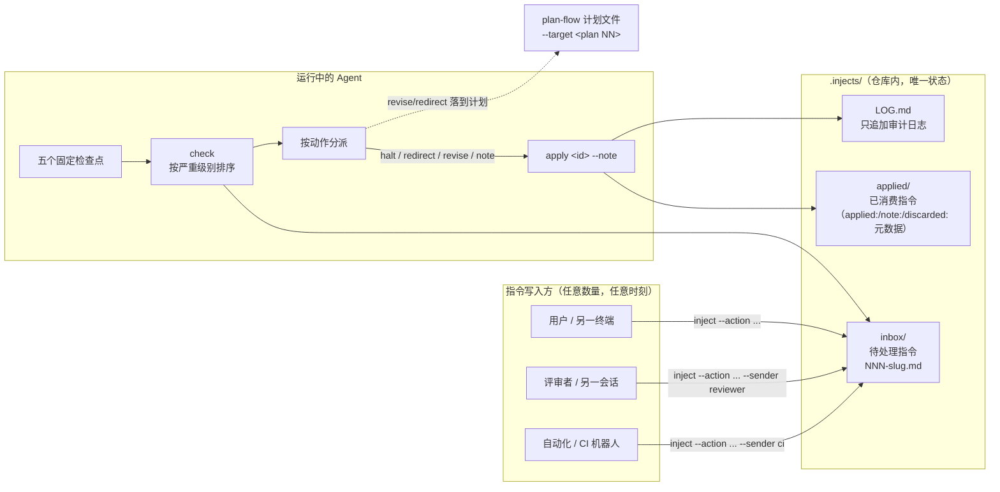
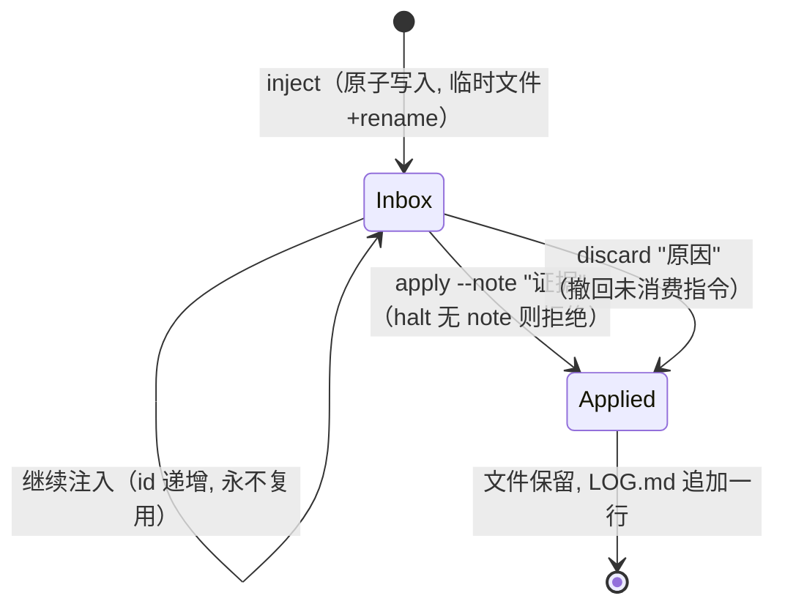
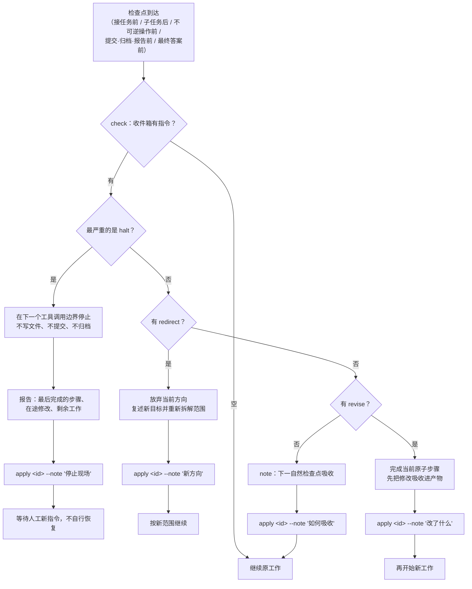
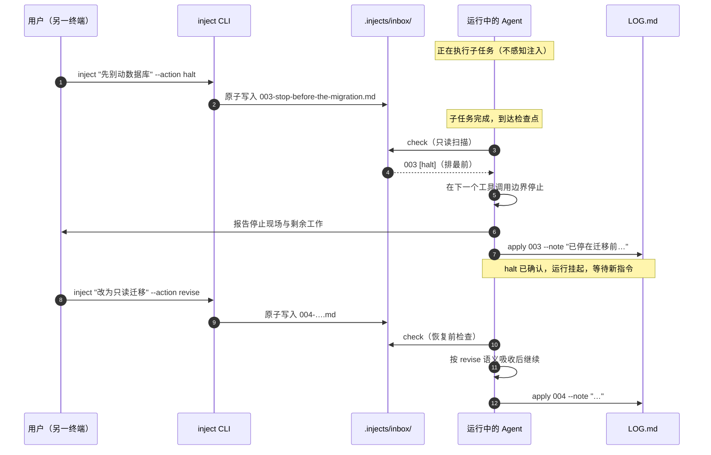

# Task Inject — Design Notes

[中文](./design.zh-CN.md)

This document explains how task-inject works internally: the architecture, the
message lifecycle, the checkpoint decision procedure, and the principles behind
each design choice.

## 1. Architecture overview

There are exactly three moving parts: writers who append instructions, the
inbox that holds them, and the running agent that drains them at checkpoints.
The repo itself is the message bus — there is no daemon, socket, or chat
stream to keep alive.

Key points:

- **Writers never touch the agent.** They append a file and leave; the agent
  notices at its next checkpoint.
- **The agent never watches a channel.** `check` is a read-only directory
  scan, cheap enough to run five times per task.
- **`applied/` and `LOG.md` are append-mostly.** Nothing is ever deleted;
  history is the audit trail.

## 2. Message lifecycle

A message is created in `inbox/` and leaves it exactly once — by `apply`
(consumed with evidence) or `discard` (withdrawn with a reason). Both endings
keep the file and log the event, so every instruction has a provable outcome.

Guarantees enforced by the script:

| Guarantee | Mechanism |
| --- | --- |
| No half-written message is ever read | `inject` writes to a temp file, then `os.replace` (atomic rename) |
| A halt cannot be consumed silently | `apply` refuses a `halt` without `--note` |
| Ids never repeat | Next id = max id across `inbox/` + `applied/` + 1 |
| An instruction cannot be double-applied | `apply`/`discard` only resolve ids still in `inbox/` |
| No instruction is silently dropped | `check --strict` exits non-zero while `inbox/` is non-empty |

## 3. Checkpoint decision procedure

The agent runs `check` at five fixed checkpoints and nowhere else. Each pending
message is handled strictly in the printed order — severity first, so a stop
order can never hide behind a cosmetic note.

Two rules resolve conflicts when several messages are pending:

1. **Severity beats FIFO.** `check` prints `halt → redirect → revise → note`;
   the agent handles them in that order.
2. **The higher severity wins.** A `note` that contradicts a `halt` is still
   acknowledged, but the run stays stopped.

## 4. Mid-run timeline

The whole point of the skill: the instruction arrives *while the agent is
working*, without interrupting the tool call in flight.

## 5. Design principles

### 5.1 目录即状态

Pending instructions *are* files in `inbox/`; consumed ones *are* files in
`applied/`. There is no index, queue table, or status field that can drift out
of sync with reality. A corrupted run can always be reconstructed by listing
the directory and reading `LOG.md`. This is the same principle plan-flow uses
for plans, which is also why the two compose cleanly.

### 5.2 注入与执行解耦

The channel is the repo, not a socket or chat stream. Consequences:

- Feedback works **mid-run** — the agent does not need to be listening; it
  reads at checkpoints.
- Feedback works **across machines** that share the repo, and from automations
  (CI bots reacting to review comments) with no special wiring.
- There is **nothing to keep alive**: no daemon means no reconnection logic,
  no missed-message replay, no delivery guarantees to implement. The
  filesystem already provides durability and atomic rename.

### 5.3 严重级别前置，而非先进先出

A pure FIFO queue fails in exactly the case this skill exists for: a `halt`
enqueued behind three cosmetic notes gets read third, after the agent has
already spent three checkpoints doing work that should have stopped. Sorting
by severity guarantees the most urgent instruction is always surfaced first.
Within one severity, FIFO applies.

### 5.4 中断边界是工具调用，而非工具内部

`halt` stops "at the next tool-call boundary". Interrupting a tool call
mid-flight would leave partial writes and undefined state — the exact mess the
instruction is trying to prevent. Waiting for the boundary keeps every finished
step consistent and makes "报告现场" (report the scene) truthful: what is done
is really done, what is in flight is enumerable.

### 5.5 消费必须留痕（证据驱动的确认）

Reading a message is not consuming it. `apply` is the only path out of the
inbox, it stamps the file with `applied:` + a free-text evidence note, moves it
to `applied/`, and appends one line to `LOG.md`. This closes three failure
modes: the agent *reads and forgets* (note lost), *claims to have complied*
without doing anything (no evidence), or *consumes twice* (no single exit).
For `halt` the evidence note is mandatory and must state the stopping position,
so a resumed session can be reconstructed from the log alone.

### 5.6 门禁在代码，不在模型记忆

A rule the script does not enforce is a suggestion. The agent cannot "forget"
that a halt needs a note if `apply` refuses to proceed without one, and cannot
reuse ids if allocation is computed from existing files. Everything safety-
critical lives in `task_inject.py`; SKILL.md only tells the agent *when* to
call it and *how to behave* at each severity.

### 5.7 检查点而非轮询

Polling `check` in a tight loop would burn tokens and turn the inbox into a
real-time channel, re-coupling injection with execution. Five checkpoints
bound the latency of any instruction to "the current atomic step" — good
enough for feedback, and the agent's attention stays on the work between
checkpoints.

### 5.8 与现有工作流组合而非替代

- **plan-flow**: `--target <plan NN>` binds an instruction to a plan. The skill
  never edits `plans/` itself; instead, applying a `revise`/`redirect` must be
  reflected in the plan file, keeping the plan the single source of truth.
- **Git**: an injected change never authorizes a commit; commit rules are the
  repository's own.
- **CI**: `check --strict` turns "did we miss any feedback?" into an exit code
  a pipeline can assert on.

## 6. Known limitations

- A `halt` cannot interrupt the tool call currently executing; worst-case
  latency is one atomic step.
- The `.injects/` directory must be shared (committed or synced) for
  cross-machine injection; local-only use works too.
- The id space is 999 messages per inject root; archive the root to reset.
