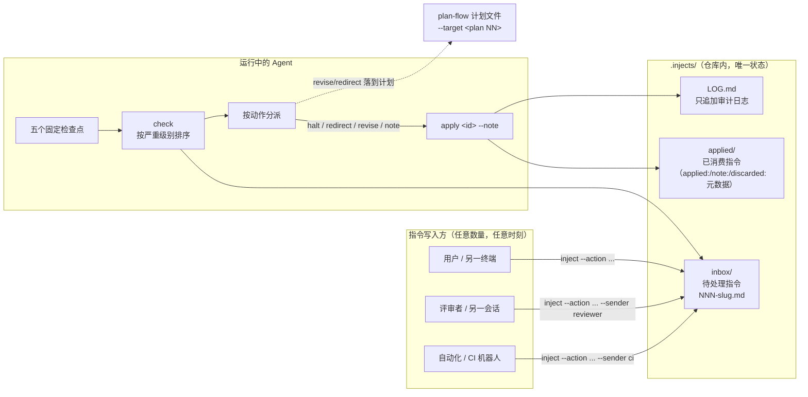
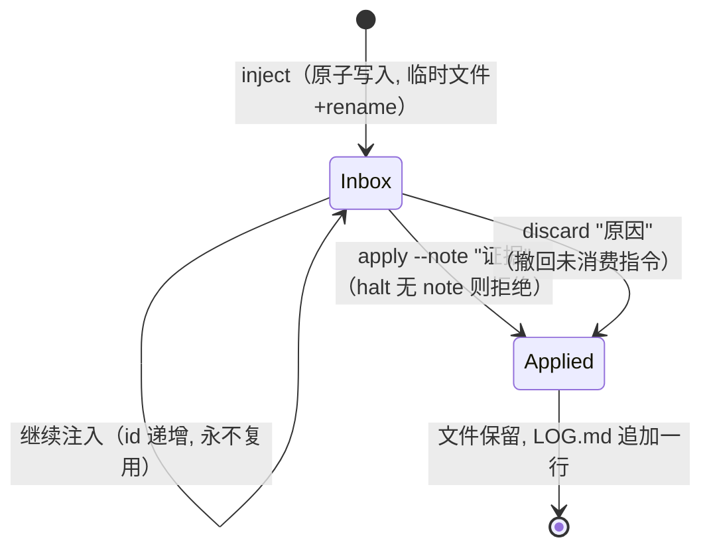
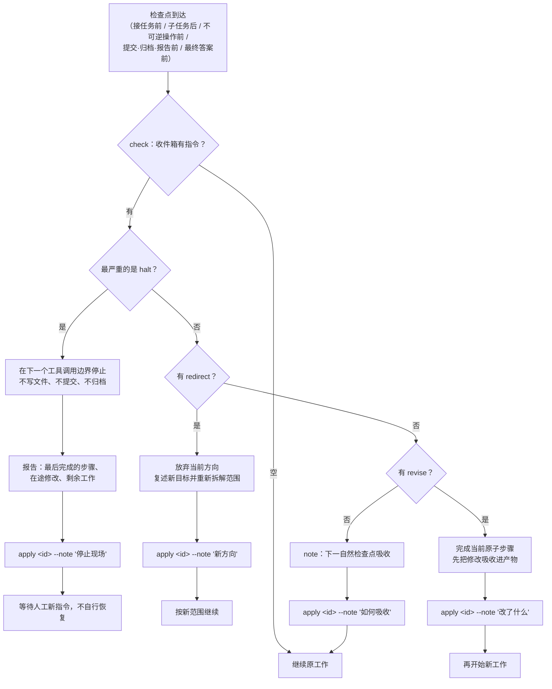
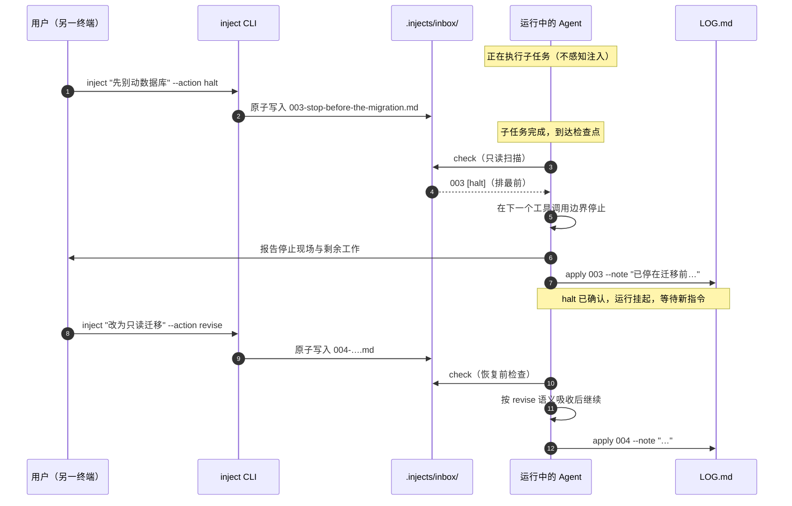

# Task Inject — 设计说明

[English](./design.md)

本文档说明 task-inject 的内部工作机制：总体架构、消息生命周期、检查点决策流程，以及每项设计选择背后的原理。

## 1. 总体架构

整个系统只有三个活动部件：追加指令的写入方、暂存指令的收件箱、在检查点消化指令的运行中 Agent。**仓库本身就是消息总线**——没有守护进程、没有套接字、没有需要维持的聊天流。

要点：

- **写入方不接触 Agent。** 写入一条文件即离开，Agent 在下一个检查点自行发现。
- **Agent 不监听任何通道。** `check` 是一次只读目录扫描，每个任务跑五次也开销极小。
- **`applied/` 与 `LOG.md` 只增不删。** 历史即审计线索，没有任何东西会被抹掉。

## 2. 消息生命周期

一条消息在 `inbox/` 中诞生，且只离开一次——或经 `apply`（带证据被消费），或经 `discard`（带原因被撤回）。两种结局都保留文件并记入日志，因此每一条指令都有可证明的结局。

脚本强制保证的性质：

| 保证 | 实现机制 |
| --- | --- |
| 永远读不到写了一半的消息 | `inject` 先写临时文件，再 `os.replace`（原子重命名） |
| halt 不可能被"默默消费" | `apply` 拒绝没有 `--note` 的 halt |
| id 永不复用 | 下一个 id = inbox/ + applied/ 中的最大 id + 1 |
| 指令不可能被重复消费 | `apply`/`discard` 只解析仍在 `inbox/` 中的 id |
| 指令不可能被静默遗漏 | `check --strict` 在 `inbox/` 非空时以非零码退出 |

## 3. 检查点决策流程

Agent 只在五个固定检查点运行 `check`，其余时间不轮询。每条待处理指令严格按打印顺序处理——严重级别优先，停止命令永远不会被次要意见挡在后面。

多条指令同时待处理时，两条规则解决冲突：

1. **严重级别优先于先进先出。** `check` 按 `halt → redirect → revise → note` 打印，Agent 按此顺序处理。
2. **高级别胜出。** 与 `halt` 矛盾的 `note` 依然会被确认留痕，但运行保持停止。

## 4. 运行中注入的时序

本技能的核心场景：指令在 **Agent 正在工作时** 到达，且不打断正在执行的工具调用。

## 5. 设计原理

### 5.1 目录即状态

待处理指令**就是** `inbox/` 里的文件，已消费的**就是** `applied/` 里的文件。不存在会与现实漂移的索引、队列表或状态字段。一次崩溃的运行总能通过列目录加读 `LOG.md` 完整重建。这与 plan-flow 对计划的做法是同一条原则，也是两者能干净组合的原因。

### 5.2 注入与执行解耦

通道是仓库，而不是套接字或聊天流。由此带来三个直接好处：

- 反馈可以**运行中生效**——Agent 不需要"正在监听"，它在检查点读取。
- 反馈可以**跨机器**使用：共享仓库的任何机器、响应评审评论的 CI 机器人都能注入，无需任何额外接线。
- **没有需要保活的东西**：没有守护进程，就没有重连逻辑、丢消息重放、投递保证要实现。文件系统已经提供了持久性与原子重命名。

### 5.3 严重级别前置，而非先进先出

纯 FIFO 队列恰好会在本技能为之存在的场景下失效：一条排在三条次要意见后面的 `halt`，要等到 Agent 按顺序读完三条意见、多做三轮本该停止的工作之后才被看到。按严重级别排序保证最紧急的指令总是最先浮出。同一级别内部仍按 FIFO。

### 5.4 中断边界是工具调用，而非工具内部

`halt` 停在"下一个工具调用边界"。在工具调用执行中途打断会留下半成品写入和未定义状态——恰恰是指令想避免的混乱。等到边界再停，每个已完成的步骤都保持一致，"报告现场"才是诚实的：做完的确实做完了，在途的可以被枚举。

### 5.5 消费必须留痕（证据驱动的确认）

"读过"不等于"消费过"。`apply` 是离开收件箱的唯一出口：在文件上盖 `applied:` 时间戳和自由文本证据备注，移入 `applied/`，并向 `LOG.md` 追加一行。这封堵了三种失败模式：读了就忘（意见丢失）、声称照办实则没做（无证据）、重复消费（无单一出口）。对 `halt` 而言证据备注是强制的，必须写明停止位置——仅凭日志即可重建恢复现场。

### 5.6 门禁在代码，不在模型记忆

脚本不强制执行的规则只是建议。当 `apply` 没有备注就拒绝执行时，Agent 不可能"忘记"halt 需要留痕；当 id 从现有文件计算得出时，Agent 不可能复用 id。所有安全关键逻辑都在 `task_inject.py` 里；SKILL.md 只告诉 Agent **何时**调用它、**在每个严重级别下如何表现**。

### 5.7 检查点而非轮询

在紧凑循环里轮询 `check` 会烧掉大量 token，还会把收件箱变成实时通道，重新耦合注入与执行。五个检查点把任何指令的生效延迟限制在"当前原子步骤"以内——对反馈足够，Agent 在检查点之间的注意力也保持在正事上。

### 5.8 与现有工作流组合而非替代

- **plan-flow**：`--target <plan NN>` 把指令绑定到计划。本技能从不直接编辑 `plans/`；而是要求 apply `revise`/`redirect` 时同步反映到计划文件，保持计划是唯一事实来源。
- **Git**：注入的修改永远不构成提交授权；提交规则属于仓库自身。
- **CI**：`check --strict` 把"有没有漏掉反馈？"变成流水线可以断言的退出码。

## 6. 已知限制

- `halt` 无法打断当前正在执行的工具调用；最坏生效延迟是一个原子步骤。
- 跨机器注入要求 `.injects/` 目录可共享（提交进仓库或同步）；仅本机使用亦可。
- 每个注入根目录的 id 空间为 999 条；归档后重建即可复位。
