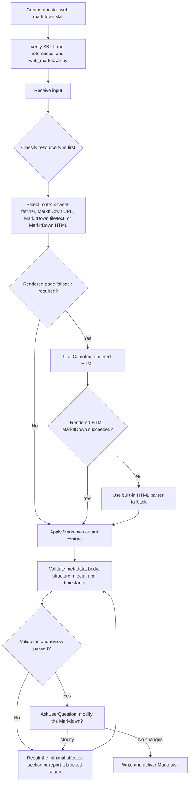

# Web Markdown

[中文](./README.zh-CN.md)

Converts generic URLs, platform-specific social and content URLs, PDFs, DOCX
files, Markdown files, plain text, screenshots/images, and pasted notes into
source-faithful Markdown. It routes supported platforms through a local platform
fetcher bridge, uses Microsoft MarkItDown for generic sources, and uses Camofox
as a rendered-page fallback when direct conversion is incomplete or unavailable.

## Install

```bash
npx skills add https://github.com/chaos-design/skills --skill web-markdown
```

## Capabilities

- Performs preflight input classification before loading conversion
  dependencies. Supported input types include platform URLs, generic URLs,
  local files, rendered HTML, direct text, and stdin.
- Routes X/Twitter, Weibo, Zhihu, Xiaohongshu, Bilibili, and WeChat Article
  URLs through the local `x-tweet-fetcher` platform fetcher bridge, then
  normalizes the fetched payload into Markdown.
- Uses Microsoft MarkItDown for generic URLs, PDFs, DOCX files, Markdown files,
  plain text, screenshots/images, and pasted-note conversion.
- Uses local Camofox rendering as a fallback for JavaScript-rendered pages,
  incomplete direct conversions, or pages that require browser rendering.
- Extracts the primary content region from `article`, `main`, `[role=main]`, or
  content-oriented containers.
- Removes common boilerplate regions, including navigation, headers, footers,
  sidebars, cookie banners, advertisements, and sharing widgets.
- Converts rendered HTML to Markdown while preserving body text, images, links,
  blockquotes, lists, tables, inline code, and fenced code blocks.
- Emits Markdown tables as contiguous table blocks, removes rendered line-number
  gutters from code blocks, and adds language identifiers to fences when they
  can be inferred.
- Writes one Markdown artifact per source under `web/<slug>.md` unless an
  explicit output path is provided.

## Used by

`web-markdown` is the standard source-normalization dependency for
`bilingual-reader` and `content-slides`. The integration flow is:

```text
raw input -> web-markdown normalizes it to Markdown -> bilingual-reader / content-slides consumes the Markdown -> close-reading page or HTML slide deck
```

If `bilingual-reader` or `content-slides` fails to process content, produces an
empty body, or drops images or code blocks, first verify that `web-markdown` is
installed correctly and can produce valid Markdown for the same source.

Install this dependency before either downstream skill:

```bash
npx skills add https://github.com/chaos-design/skills --skill web-markdown
npx skills add https://github.com/chaos-design/skills --skill bilingual-reader
npx skills add https://github.com/chaos-design/skills --skill content-slides
```

When an agent discovers that `web-markdown` is missing while using a
downstream skill, it should ask the user before installing it, show the command,
and continue only after the dependency is available.

## Platform URL Handling

Use `web-markdown` directly for platform-specific social/content URLs such as
X/Twitter, Weibo, Zhihu, Xiaohongshu, Bilibili, or WeChat Articles. These
platform routes are resolved during preflight classification: once a supported
platform host is detected, `web-markdown` calls the local `x-tweet-fetcher`
scripts before evaluating MarkItDown or rendered-page fallback paths. Generic
article pages use MarkItDown first and Camofox only as a rendered-page fallback.

## Usage

```bash
python3 skills/web-markdown/scripts/web_markdown.py \
  "https://example.com/article"
```

Local files supported by MarkItDown:

```bash
python3 skills/web-markdown/scripts/web_markdown.py ./paper.pdf
python3 skills/web-markdown/scripts/web_markdown.py ./brief.docx
python3 skills/web-markdown/scripts/web_markdown.py ./notes.md
python3 skills/web-markdown/scripts/web_markdown.py ./notes.txt
python3 skills/web-markdown/scripts/web_markdown.py ./screenshot.png
```

Pasted notes:

```bash
python3 skills/web-markdown/scripts/web_markdown.py --text "Meeting notes..."
pbpaste | python3 skills/web-markdown/scripts/web_markdown.py --stdin
```

With an explicit output file:

```bash
python3 skills/web-markdown/scripts/web_markdown.py \
  "https://example.com/article" \
  --output web/example-article.md
```

## End-to-End Processing Flow

`web-markdown` is the standard source-normalization skill for durable Markdown
archives. A complete run classifies the input first, executes the selected
conversion route, validates the Markdown artifact, and enters review and repair
only when validation results or confidence level require it.



1. Install the skill with `SKILL.md`, `references/`, and `scripts/web_markdown.py` intact.
2. Configure Python, `markitdown[all]`, optional Camofox rendering, output location, and overwrite policy.
3. Classify the resource type before dependency checks or conversion. Platform URLs route to `x-tweet-fetcher`; generic URLs use MarkItDown with Camofox fallback; local files and pasted text use MarkItDown.
4. Execute only the selected conversion route. HTML files also use MarkItDown first; if generic URL or HTML conversion fails, use Camofox-rendered HTML and then the built-in HTML parser fallback when necessary.
5. Validate source metadata, body completeness, media preservation, code and table structure, and UTC+8 timestamp formatting.
6. Run review or repair only when confidence is low, validation fails, or the user explicitly requests review.
7. Before writing the output, use `AskUserQuestion` to ask whether the user wants modifications. Write and deliver the artifact only after the user confirms that no changes are needed.

## Requirements

- Python 3.9+.
- Microsoft MarkItDown with full document/image extras.

```bash
pip install 'markitdown[all]'
```

- A local Camofox service on `localhost:9377` when rendered-page fallback is
  needed.

```bash
curl http://localhost:9377/health
```

## Non-goals

- It does not translate, summarize, or rewrite the source page.
- It does not bypass authentication, paywalls, private workspaces, or access
  controls.
- It does not replace the low-level monitoring, timeline, or growth analytics
  capabilities in `x-tweet-fetcher`; it only uses fetcher output to create
  Markdown archives.

## License

Apache-2.0. See [`LICENSE`](LICENSE).
