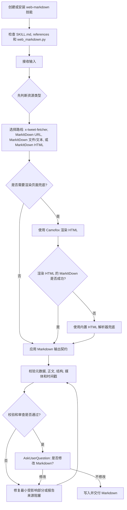

# Web Markdown

[English](./README.md)

将通用 URL、平台特定社交与内容 URL、PDF、DOCX、Markdown 文件、纯文本、截图/图片和粘贴笔记转换为忠实于来源的 Markdown。它会通过本地平台抓取桥接处理受支持的平台来源，使用 Microsoft MarkItDown 处理通用来源，并在直接转换不完整或不可用时使用 Camofox 作为渲染页面兜底。

## 安装

```bash
npx skills add https://github.com/chaos-design/skills --skill web-markdown
```

## 能力

- 在加载转换依赖前执行前置输入分类，支持平台 URL、通用 URL、本地文件、渲染 HTML、直接文本和 stdin。
- 将 X/Twitter、微博、知乎、小红书、Bilibili 和微信公众号文章 URL 路由到本地 `x-tweet-fetcher` 平台抓取桥接，再将抓取结果标准化为 Markdown。
- 使用 Microsoft MarkItDown 转换通用 URL、PDF、DOCX、Markdown 文件、纯文本、截图/图片和粘贴笔记。
- 对需要浏览器渲染、直接转换不完整或必须渲染后读取的页面，使用本地 Camofox 作为渲染页面兜底。
- 从 `article`、`main`、`[role=main]` 或面向正文的容器中提取主要内容区域。
- 移除常见样板区域，包括导航、页眉、页脚、侧栏、Cookie 横幅、广告和分享组件。
- 将渲染后的 HTML 转换为 Markdown，并保留正文文本、图片、链接、引用、列表、表格、行内代码和围栏代码块。
- 将表格输出为连续的 Markdown 表格块，移除代码块中由页面渲染产生的行号槽，并在可推断时为围栏代码块补充语言标识。
- 默认每个来源生成一个 Markdown 产物并写入 `web/<slug>.md`；也支持显式指定输出路径。

## 被依赖关系

`web-markdown` 是 `bilingual-reader` 和 `content-slides` 的标准来源标准化依赖。集成流程为：

```text
原始输入 → web-markdown 标准化为 Markdown → bilingual-reader / content-slides 消费 Markdown → 输出精读页面或 HTML 幻灯片
```

如果 `bilingual-reader` 或 `content-slides` 出现内容处理失败、正文为空、图片或代码块丢失等问题，请先确认 `web-markdown` 已正确安装，并能为同一来源生成有效 Markdown。

安装下游技能前，请先安装本依赖：

```bash
npx skills add https://github.com/chaos-design/skills --skill web-markdown
npx skills add https://github.com/chaos-design/skills --skill bilingual-reader
npx skills add https://github.com/chaos-design/skills --skill content-slides
```

当 Agent 在使用下游技能时发现 `web-markdown` 缺失，应先询问用户是否安装，展示安装命令，并在依赖可用后再继续执行。

## 平台 URL 处理

平台特定的社交与内容 URL 统一使用 `web-markdown`，包括 X/Twitter、微博、知乎、小红书、Bilibili 和微信公众号文章。这些平台路由在前置分类阶段确定：一旦识别到受支持的平台域名，`web-markdown` 会先调用本地 `x-tweet-fetcher` 脚本，而不会先评估 MarkItDown 或渲染页面兜底。通用文章页优先使用 MarkItDown，仅在需要时使用 Camofox 作为渲染页面兜底。

## 使用

```bash
python3 skills/web-markdown/scripts/web_markdown.py \
  "https://example.com/article"
```

MarkItDown 支持的本地文件：

```bash
python3 skills/web-markdown/scripts/web_markdown.py ./paper.pdf
python3 skills/web-markdown/scripts/web_markdown.py ./brief.docx
python3 skills/web-markdown/scripts/web_markdown.py ./notes.md
python3 skills/web-markdown/scripts/web_markdown.py ./notes.txt
python3 skills/web-markdown/scripts/web_markdown.py ./screenshot.png
```

粘贴笔记：

```bash
python3 skills/web-markdown/scripts/web_markdown.py --text "Meeting notes..."
pbpaste | python3 skills/web-markdown/scripts/web_markdown.py --stdin
```

指定输出文件：

```bash
python3 skills/web-markdown/scripts/web_markdown.py \
  "https://example.com/article" \
  --output web/example-article.md
```

## 完整处理流程

`web-markdown` 是生成可持久归档 Markdown 的标准来源标准化技能。完整流程会先判断输入类型，执行选定的转换路线，校验 Markdown 产物，并仅在校验结果或置信度要求时进入审查与修复。



1. 安装技能，并保持 `SKILL.md`、`references/` 和 `scripts/web_markdown.py` 完整。
2. 配置 Python、`markitdown[all]`、可选 Camofox 渲染、输出位置和覆盖策略。
3. 在依赖检测或转换前先判断资源类型。平台 URL 路由到 `x-tweet-fetcher`；通用 URL 使用 MarkItDown，并以 Camofox 作为兜底；本地文件和粘贴文本使用 MarkItDown。
4. 仅执行选定的转换路线。HTML 文件也优先使用 MarkItDown；如果通用 URL 或 HTML 转换失败，必要时使用 Camofox 渲染 HTML，再使用内置 HTML 解析器兜底。
5. 校验来源元数据、正文完整性、媒体保留情况、代码与表格结构，以及 UTC+8 时间戳格式。
6. 仅当置信度低、校验失败或用户明确要求审查时，才执行审查或修复。
7. 写入输出前，必须通过 `AskUserQuestion` 询问用户是否需要修改；用户确认无需修改后，才写入并交付产物。

## 依赖

- Python 3.9+。
- Microsoft MarkItDown 及完整文档/图片扩展。

```bash
pip install 'markitdown[all]'
```

- 仅当需要渲染页面兜底时，需要本地 Camofox 服务监听 `localhost:9377`。

```bash
curl http://localhost:9377/health
```

## 不做什么

- 不翻译、摘要或改写源页面。
- 不绕过登录、付费墙、私有工作区或访问控制。
- 不替代 `x-tweet-fetcher` 中的底层监控、时间线或增长分析能力；本技能仅使用抓取器输出创建 Markdown 归档。

## 许可证

Apache-2.0，详见 [`LICENSE`](LICENSE)。
