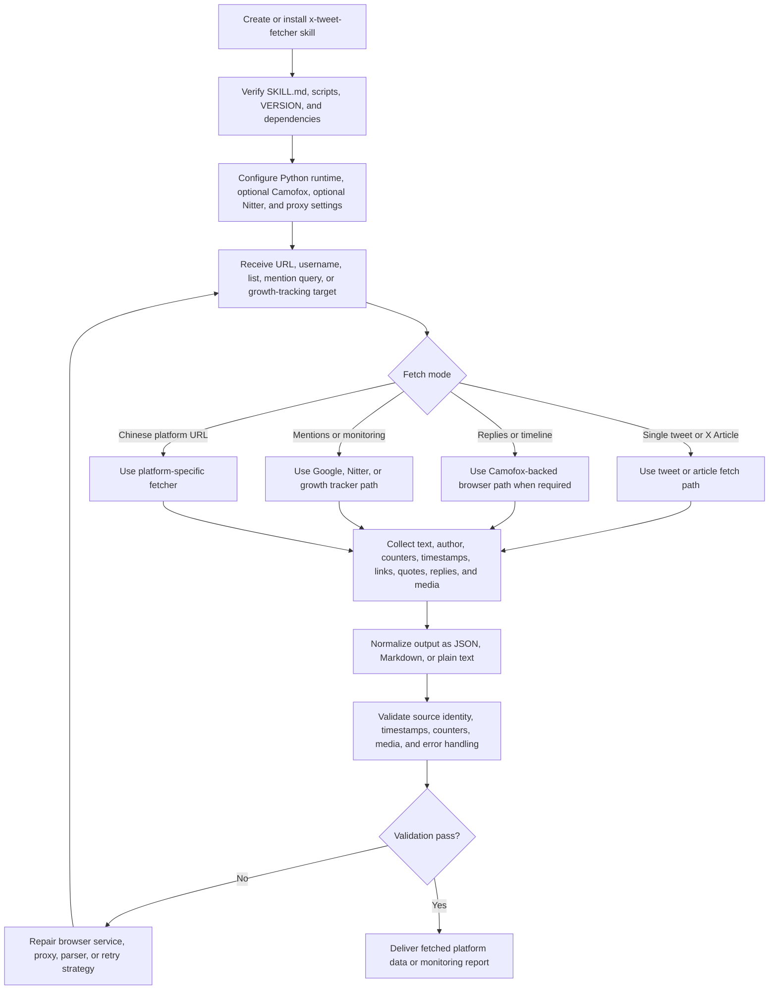

# X-Tweet-Fetcher Capabilities

**Source:** [https://github.com/ythx-101/x-tweet-fetcher/](https://github.com/ythx-101/x-tweet-fetcher/)

This skill provides zero-API-key data extraction and monitoring capabilities for X (Twitter) and supported Chinese content platforms. The capability summary below is derived from the upstream project CHANGELOG.

## Core Capabilities

### 1. X (Twitter) Data Extraction
- **Single Tweet Extraction**: Fetch tweets through the FxTwitter API without additional runtime dependencies or API keys.
- **Reply Threads & Nested Replies**: Extract tweet replies, including nested thread replies and links in the comment section.
- **User Timeline**: Fetch user timelines with support for pagination (up to 200+ tweets) and correct chronological sorting (Snowflake ID).
- **X Lists**: Fetch tweets from specific X Lists using list IDs or URLs, with pagination support.
- **X Articles & Quoted Tweets**: Full-text extraction for long-form X Articles and automatic inclusion of quoted tweets and retweet tracking.

### 2. Mentions & Growth Monitoring
- **Real-time Mentions Monitoring**: Monitor who mentioned specific users (`@username`) using Google Search via Camofox, without needing an API key. Includes incremental detection and cron integration.
- **Nitter Mentions**: Real-time X mention monitoring based on Nitter.

### 3. Chinese Platform Support
- **Multi-Platform Extraction**: Support for extracting content from Weibo (posts, comments, engagement metrics), Bilibili (video information, engagement metrics, danmaku), CSDN (articles and code blocks), and Xiaohongshu (via proxy/cookies).
- **WeChat Articles & Search**: Fetch WeChat official account articles directly. Supports Sogou WeChat search with real URL resolution via Google/DDG and SSH proxy capabilities.
- **Auto-Detection**: Automatically detects the platform based on the provided URL.

### 4. Advanced Technical Features
- **Camofox & Nitter Integration**: Uses Camofox (anti-detect browser) and Nitter for privacy-respecting, zero-cost data extraction.
- **Proxy Support**: Built-in support for SSH proxies and 24/7 home router proxies.
- **Flexible Output Formats**: Export data in JSON, Markdown (with YAML frontmatter), or plain text.
- **Robust Parsing**: Advanced regular expressions and fault-tolerant parsing for engagement metrics, icons, and nested content.

## End-to-End Processing Flow

`x-tweet-fetcher` is the low-level platform data extractor used directly or through `web-markdown`. A complete run installs the skill, configures optional browser services, selects the correct extraction mode, extracts source data, and validates the output format.

1. Install or copy the skill with `SKILL.md`, `scripts/`, `VERSION`, and dependency files intact.
2. Configure Python dependencies and optional services: Camofox for browser-backed extraction, Nitter for mention monitoring, and proxy settings when required by the target platform.
3. Choose the extraction mode from the input: single tweet, X Article, reply thread, user timeline, X List, mentions, growth tracking, or supported Chinese platform URL.
4. Fetch source data while preserving author, timestamps, engagement counters, links, quoted content, replies, and media.
5. Normalize the result into JSON, Markdown, or plain text according to the caller's requested output format.
6. Validate source identity, timestamp format, counters, media references, nested content, retry behavior, and explicit errors before returning data to the user or upstream skill.
