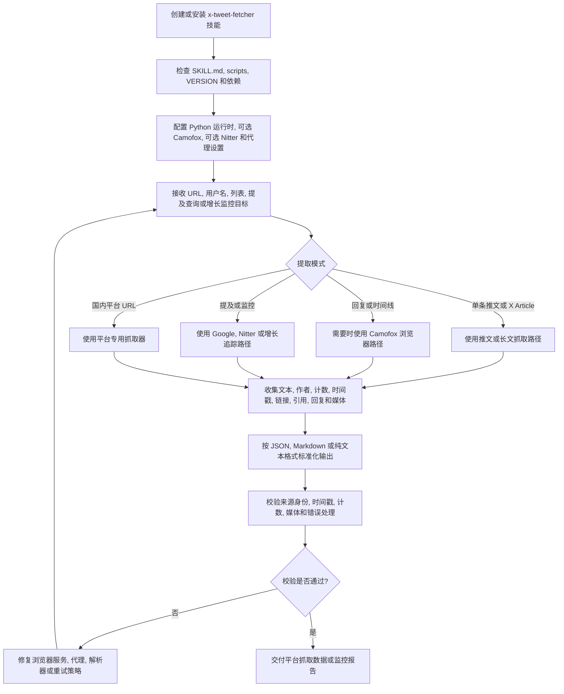

# X-Tweet-Fetcher 技能能力说明

**技能来源：** [https://github.com/ythx-101/x-tweet-fetcher/](https://github.com/ythx-101/x-tweet-fetcher/)

本技能提供无需 API Key 的跨平台数据提取与监控能力，覆盖 X (Twitter) 以及多个国内主流内容平台。以下能力概述基于上游项目 CHANGELOG 提炼。

## 核心能力

### 1. X (Twitter) 数据提取
- **单条推文提取**：通过 FxTwitter API 提取单条推文，无额外运行时依赖，也无需 API Key。
- **评论区与嵌套回复**：通过 Camofox 和 Nitter 深入抓取推文回复，支持嵌套评论和评论区链接的精准提取。
- **用户时间线**：抓取用户历史推文，支持翻页（最多200条），并按 Snowflake ID 正确降序排列。
- **X Lists 抓取**：支持通过纯数字 ID 或完整 URL 抓取 X 列表中的推文，并支持翻页与去重。
- **长文与引用推文**：支持 X Articles 长文的完整内容提取，并能准确分离与识别转推（Retweet）及引用推文（Quote）。

### 2. 提及与增长监控
- **Mentions 提及监控**：实时监控指定用户（`@username`）的提及情况。基于 Google 搜索与 Camofox，支持增量检测、本地缓存去重以及 Cron 定时任务集成。
- **Nitter Mentions 监控**：基于 Nitter 提供额外的实时 X 提及监控能力。

### 3. 国内平台支持
- **多平台内容提取**：
  - **微博**：提取帖子内容、评论及互动指标。
  - **B站**：提取视频信息、UP 主数据、播放量、点赞和弹幕。
  - **CSDN**：抓取技术文章正文、代码块及阅读量。
  - **小红书**：支持代理与 Cookie 模式下的内容抓取。
- **微信公众号与搜索**：纯 HTTP 抓取微信公众号全文与图片；支持搜狗微信搜索，并能通过 Google/DDG 解析真实 URL。
- **自动平台识别**：根据输入的 URL 自动路由到对应平台的解析器。

### 4. 高级技术特性
- **防反爬技术**：集成 Camofox（防指纹浏览器）与 Nitter，实现稳定且注重隐私的免登录抓取。
- **代理支持**：支持 SSH 代理以及 24/7 家庭路由器代理转发。
- **多格式输出**：支持输出为 JSON、Markdown（含 YAML frontmatter）以及纯文本格式。
- **健壮解析**：针对各种数据格式（如带逗号的数字、特殊字符结尾的统计信息）提供容错正则匹配与提取能力。

## 完整处理流程

`x-tweet-fetcher` 是可直接使用、也可被 `web-markdown` 调用的底层平台数据提取技能。完整流程包括安装技能、配置可选浏览器服务、选择提取模式、提取来源数据并验证输出格式。

1. 安装或复制技能，并保持 `SKILL.md`、`scripts/`、`VERSION` 和依赖文件完整。
2. 配置 Python 依赖和可选服务：Camofox 用于浏览器抓取，Nitter 用于提及监控，目标平台需要时配置代理。
3. 根据输入选择提取模式：单条推文、X Article、回复串、用户时间线、X List、提及、增长监控或支持的国内平台 URL。
4. 抓取来源数据，并保留作者、时间戳、互动计数、链接、引用内容、回复和媒体。
5. 按调用方需要将结果标准化为 JSON、Markdown 或文本。
6. 返回用户或上游技能前，校验来源身份、时间戳格式、计数、媒体引用、嵌套内容、重试行为和显式错误。
